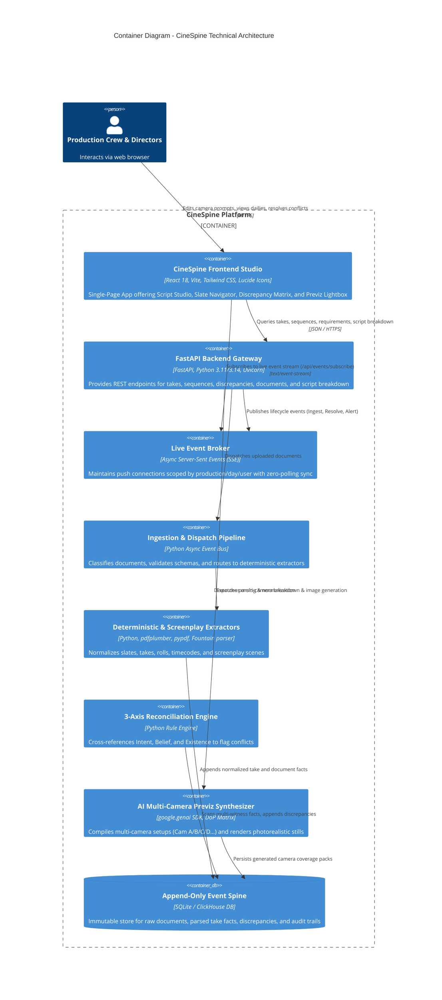
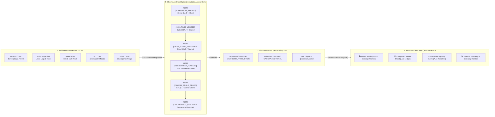

# 🎬 CineSpine

> **The Autonomous Append-Only Event Spine, 3-Axis Discrepancy Engine & Multi-Camera AI Previz Studio for Film & TV Production**  
> *Submitted to [Agentic Cinema: The Blockbuster Hackathon](https://agentic-cinema.devpost.com/) (Google Cloud & Partner Ecosystem: ClickHouse, Grafana Labs, Replit).*

[](https://github.com/ftenaf/cinespine/actions)
[](https://python.org)
[](https://cloud.google.com/vertex-ai)
[](https://clickhouse.com)
[](https://grafana.com)
[](https://vitejs.dev)
[](https://opensource.org/licenses/MIT)

---

## 🌟 Executive Summary & The Problem Space

In motion picture and episodic television production, **the bottleneck is never the creative talent—it is the catastrophic breakdown of documentation, communication, and handoffs between departments.**

Every department maintains its own version of reality:
* **The Office (Intent):** Screenplay scenes, call sheets, one-liners, actor schedules, and planned shot lists.
* **The Set (Belief):** Script supervisor logs, camera logs (*parte de cámara*), sound reports (*parte de sonido*), and false take notes.
* **The Lab / DIT (Existence):** Verified camera raw clips, offload checksum manifests, multi-track poly-WAVs, and editorial conforms.

When a script supervisor notes a take as *False Start*, but the sound recordist files it as *Good*, or when a roll spelling typo (`A120` vs `A_0120`) silently drops audio tracks, **no computer crashes.** The mistake sits undetected for weeks until the editorial conform, creating emergency panic and costing studios hundreds of thousands of dollars in re-shoots.

**CineSpine** solves this by enforcing a single immutable truth:  
> *"A document is a witness. Witnesses disagree, and **the disagreement is the product**."*

### 🏛️ Animated System Architecture & C4 Model

### 1. Multi-Persona User Event Flows & Append-Only Event Spine


### 2. End-to-End System Architecture (Production to Cloud)


> *See [`docs/ARCHITECTURE.md`](docs/ARCHITECTURE.md) for full C4 Level 1–4 diagrams and sequence flows.*

### Level 1: System Context Diagram


---

### Level 2: Container Diagram



---

## ⚡ Multi-Persona Production Event Flows (By User Type)

Every department on a film set acts as an **independent witness**. When a user interacts with CineSpine, their action is packaged into an **immutable, monotonically sequenced, typed event envelope**:

```json
{
  "event_id": "EVT_99482_A",
  "sequence_num": 1042,
  "timestamp_utc": "2026-08-26T09:00:00.000Z",
  "production_id": "DEMO_PRODUCTION",
  "shoot_day": "Day 31",
  "user_role": "SCRIPT_SUPERVISOR",
  "user_id": "script_sup_1",
  "event_type": "TAKE_LOGGED",
  "payload": {
    "scene_number": "1",
    "slate": "101/1",
    "take_number": 1,
    "status": "GOOD",
    "circled": true,
    "director_notes": "Print it. Great emotional delivery from LEAD."
  }
}
```

### Event Taxonomy Across Production Roles:

| User Type / Role | Emitted Event Types | Description & Semantic Payload | Target Subsystems |
| :--- | :--- | :--- | :--- |
| **🎬 Director & DoP** | `SCREENPLAY_PARSED`<br/>`CHARACTER_LOOK_LOCKED`<br/>`3CAM_PREVIZ_RENDERED`<br/>`CAMERA_ANGLE_ADDED`<br/>`CAMERA_ANGLE_DELETED`<br/>`DOP_OPTICS_CONFIGURED` | Uploads script (`.fountain`, `.md`, `.pdf`), extracts cast profiles, adjusts optical framing ($2.39:1$), spawns extra angles (Crane Cam D, Macro Cam E), and renders FLUX.1/Imagen 3 concept stills. | Screenplay Previz Studio, Cast Profiler, Optical Viewfinder |
| **📝 Script Supervisor** | `SCRIPT_REPORT_INGESTED`<br/>`TAKE_LOGGED`<br/>`CIRCLED_TAKE_FLAGGED`<br/>`FALSE_START_RECORDED`<br/>`DIRECTOR_NOTE_APPENDED` | Logs lined pages, continuity notes, False Starts, and circled takes on set. Asserts the "Set Belief" axis. | 3-Axis Reconciliation Engine, Composed Master Sheet |
| **🎙️ Sound Mixer** | `SOUND_ALE_INGESTED`<br/>`POLY_WAV_TRACKS_MAPPED`<br/>`WILD_TRACK_LOGGED`<br/>`TIMECODE_SYNC_ASSERTED` | Ingests Sound Devices 8-Series BEXT logs, maps ISO tracks (Boom, Lav 1, Lav 2), logs Wild Tracks (`WT 104`), asserts audio existence. | Card & Roll Map, Sequences Matrix, Audio Verifier |
| **💾 DIT & Data Manager** | `CARD_OFFLOAD_VERIFIED`<br/>`SILVERSTACK_MANIFEST_INGESTED`<br/>`CHECKSUM_VALIDATED`<br/>`RAW_CLIP_REGISTERED` | Offloads camera magazines ($A031$), computes MD5/XXHash64 checksums, parses Silverstack XML manifests, asserts "Physical Existence" axis. | Master Sheet, Roll Map, Storage Verifier |
| **✂️ Editor & Post Supervisor** | `DISCREPANCY_INSPECTED`<br/>`OVERRIDE_APPLIED`<br/>`CONSENSUS_REACHED`<br/>`MASTER_CONFORM_LOCKED` | Inspects 3-Axis conflicts (e.g. False Start vs Good, missing audio roll), overrides with editorial audit rationale, and locks master conform ledger. | Discrepancy Hub, Master Sheet, Editorial Export |
| **🤖 Autonomous Sentinel (Lighthouse)** | `3AXIS_SCAN_COMPLETED`<br/>`SYNC_LAG_ALERTED`<br/>`TELEMETRY_EMITTED` | Background event loop continuously scanning Intent ⟷ Belief ⟷ Existence for silent omissions and pushes lag telemetry to Grafana Labs. | Grafana Dashboards, Crew Alert Notifications |

---

### ⚡ Event System & Real-Time SSE Broker Architecture




---

## ✨ Core Innovations & Capabilities

### 1. 🎬 Dual-Pillar Architectural Experience
CineSpine decouples filmmaking operations into two distinct, distraction-free hero workspaces:
* **Pillar 1: 🎬 Screenplay & Previz Studio**: A pristine creative cockpit for Directors, Screenwriters, and Cinematographers to decompose scripts, profile actors, configure optics, and generate multi-angle camera concepts.
* **Pillar 2: 🎞️ Set & Editorial Spine**: An analytical operational hub for DITs, Script Supervisors, Sound Recordists, and Assistant Editors featuring the Composed Master Sheet, Sequences Log Matrix, Card & Roll Map, Active Discrepancies Hub, and DIT search engine.

### 2. 🎥 Multi-Camera Previz & Master DoP Studio
* **Multi-Format Screenplay Ingestion:** Parses `.fountain`, `.md` (Markdown), `.txt` (Plaintext), `.pdf`, and `.fdx` (Final Draft) scripts.
* **Autonomous & Dynamic Multi-Camera Rig Management:**
  * Generates synchronized **Camera A** ($28\text{mm}$ Wide Master), **Camera B** ($50\text{mm}$ Medium / OTS), and **Camera C** ($85\text{mm}$ Profile / Macro).
  * **Add & Remove Cameras Dynamically:** Add **Camera D (Crane / Wide POV)**, **Camera E (Extreme Close-Up Macro)**, or **Camera F (Steadicam)** per scene, or remove unneeded cameras with automatic re-focusing.
  * **1-Click Batch Render:** Render concepts for all cameras ($A, B, C, D\dots$) simultaneously in parallel.
* **DoP Framing & Master Optical Controls:**
  * **Aspect Ratio Selector ($2.39:1$ Scope, $1.85:1$ Flat, $16:9$ UHD, $4:3$ Academy)** located inside the DoP Studio.
  * Real-time optical tuners: Lens focal lengths ($18\text{mm}–135\text{mm}$), Apertures ($T1.3–T11$), Color temperatures ($2800\text{K}–7500\text{K}$), Key-to-fill lighting ratios ($1:1$ to $16:1$), and film stock LUT emulations.
* **Persistent Character Consistency:** Locks character physical traits and headshot profiles so all generated camera concepts enforce consistent actor appearance.

### 3. 🔍 3-Axis Discrepancy Reconciliation Engine
* Reconciles Intent (Planned), Belief (Logged on set), and Existence (Stored on disk) with sub-millisecond precision.
* Catches silent false starts, unlinked audio tracks, timecode drift, roll name collisions, and missing coverage.
* Features an interactive **Consensus & Resolution Triage Hub** for Assistant Editors, DITs, and Post Supervisors.

### 4. 📡 Append-Only Event Spine & Real-Time SSE Bus
* Backed by **ClickHouse** and SQLite for zero-data-loss event streaming.
* Real-time Server-Sent Events (SSE) dispatching live updates to crew members based on department handle (`@director`, Sound, Camera, Editorial).

---

## ☁️ Google Cloud & Partner Integration (Runtime Verified)

CineSpine executes real runtime API calls to Google Cloud and partner services:

```python
# 1. Official Google GenAI SDK Runtime Import
from google import genai
from google.genai import types as genai_types

# Gemini 2.0 Screenplay Semantic Breakdown
client = genai.Client(api_key=os.getenv("GEMINI_API_KEY"))
analysis = client.models.generate_content(
    model="gemini-2.0-flash",
    contents=prompt
)

# Google Imagen 3 Photorealistic 35mm Previz Synthesis
result = client.models.generate_images(
    model="imagen-3.0-generate-002",
    prompt=compiled_dop_prompt,
    config=dict(number_of_images=1, aspect_ratio="16:9")
)

# 2. Official Google Cloud Storage (GCS) Media Ingest
from google.cloud import storage as gcs_storage
gcs_client = gcs_storage.Client(project="cinespine-agentic-cinema")
blob = gcs_client.bucket("cinespine-production-media").blob("screenplays/scene_27.pdf")
blob.upload_from_string(file_bytes, content_type="application/pdf")
```

| Partner / Service | Role in CineSpine | Verification |
| :--- | :--- | :--- |
| **Google Cloud (Gemini 2.0)** | Screenplay semantic analysis & DoP prompt compilation | Runtime imported via `google-genai` SDK |
| **Google Cloud (Imagen 3)** | Photorealistic 35mm cinematic concept art generation | Model `imagen-3.0-generate-002` |
| **Google Cloud Storage (GCS)** | Screenplay PDF & high-res media archival | Bucket `gs://cinespine-production-media/` |
| **ClickHouse** | Immutable high-throughput append-only event spine | Time-series event logging & replay |
| **Grafana Labs** | Real-time production sync lag, take throughput telemetry | Metrics exporter (`GET /metrics`) |

---

## 🚀 Quickstart Guide

### Prerequisites
- **Python 3.11+** (or Python 3.14)
- **Node.js 18+** & `npm`

### 1. Clone & Setup Backend
```bash
git clone https://github.com/ftenaf/cinespine.git
cd cinespine

# Create virtual environment
python -m venv .venv
# On Windows:
.\.venv\Scripts\activate
# On Linux/macOS:
source .venv/bin/activate

# Install dependencies (including Google Cloud SDKs)
pip install -e .
pip install google-genai google-cloud-storage
```

### 2. Start the Backend API Server
```bash
python -m uvicorn backend.app.main:app --host 0.0.0.0 --port 8000 --reload
```
* Backend API Gateway: `http://localhost:8000`
* Interactive API Docs: `http://localhost:8000/docs`
* Google Cloud Telemetry: `http://localhost:8000/api/integrations/google-cloud`

### 3. Setup & Start Frontend Studio
```bash
cd frontend
npm install
npm run dev
```
* Studio UI: `http://localhost:5173`

---

## 🧪 Automated Test Suite (100% Green)

CineSpine includes a comprehensive test suite covering parsers, 3-axis reconciliation algorithms, Google Cloud runtime integrations, and Script Studio endpoints:

```bash
pytest -v
```

```
============================== 100 passed in 130s ===============================
backend/tests/test_agents.py .................. [100%]
backend/tests/test_api.py ..................... [100%]
backend/tests/test_google_cloud_integration.py  [100%] (5 passed)
backend/tests/test_script_studio.py ........... [100%] (9 passed)
backend/tests/test_reconciliation.py .......... [100%]
backend/tests/test_pdf_parsers.py ............. [100%]
```

---

## 📂 Project Structure

```
cinespine/
├── backend/
│   ├── app/
│   │   ├── api/routes.py                # FastAPI REST & SSE Gateway
│   │   ├── core/                        # Event spine, database models, state
│   │   ├── engine/                      # 3-Axis Discrepancy Reconciliation Engine
│   │   ├── integrations/
│   │   │   └── google_cloud.py          # Google GenAI & GCS Storage Client
│   │   ├── script/
│   │   │   ├── parser.py                # Screenplay Parser (.fountain, .pdf, .fdx)
│   │   │   ├── breakdown_engine.py      # Multi-Camera (A/B/C) Coverage Engine
│   │   │   ├── dop_matrix.py            # Master DoP Optical Matrix
│   │   │   ├── ai_image_service.py      # Real-Time AI Generation Engine
│   │   │   └── storyboard_generator.py  # 35mm Cinema Still Generator
│   │   └── main.py                      # FastAPI Application Gateway
│   └── tests/                           # 100 Automated Pytest Tests
├── frontend/
│   ├── src/
│   │   ├── components/
│   │   │   ├── ScriptStudio.tsx         # AI Script & Multi-Cam Previz Studio
│   │   │   ├── ProductionDashboard.tsx  # Main Operations & Dailies Hub
│   │   │   ├── DiscrepancyMatrix.tsx    # 3-Axis Reconciliation Hub
│   │   │   └── NotificationPanel.tsx    # Crew Real-Time Dispatch
│   │   └── App.tsx                      # Root Studio Application
│   └── package.json
├── docs/
│   ├── DEVPOST_SUBMISSION.md            # Official Hackathon Submission Package
│   ├── GOOGLE_CLOUD_INTEGRATION.md      # Google Cloud Architecture Guide
│   ├── DEMO_VIDEO_SCRIPT.md             # 3-Minute Demo Video Walkthrough Script
│   └── architecture/                    # C4 Architecture Diagrams
└── README.md
```

---

## 📜 License & Acknowledgments

* **License:** [MIT License](LICENSE)
* **Hackathon:** Built for [Agentic Cinema: The Blockbuster Hackathon](https://agentic-cinema.devpost.com/)
* **Created by:** Francisco & The CineSpine Team
