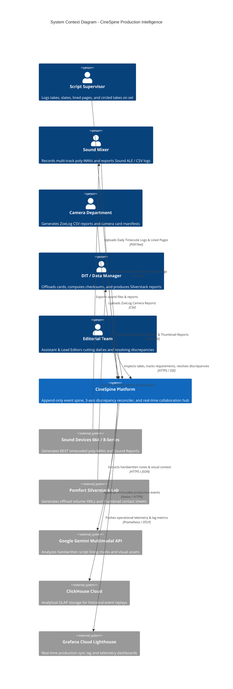
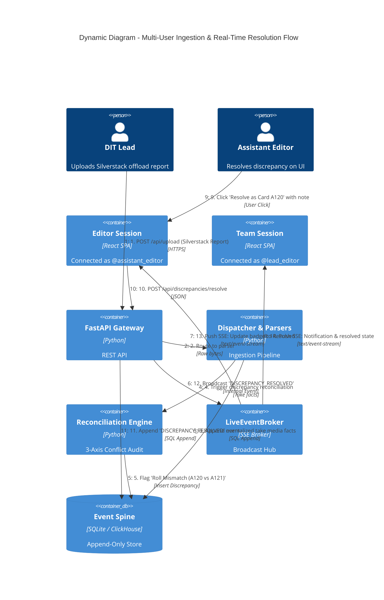

# 🎬 CineSpine

> **The Append-Only Event Spine, Real-Time Collaboration Hub & 3-Axis Discrepancy Reconciliation Engine for Film & TV Production**

[](https://github.com/ftenaf/cinespine/actions)
[](https://python.org)
[](https://nodejs.org)
[](https://opensource.org/licenses/MIT)

---

## 📖 The Problem

Film and television productions run on fragmented daily paperwork created by five different departments across set and post-production. Every department keeps its own truth in its own silo:

* **Office:** Call sheets and Daily Production Reports (*parte de producción*) $\rightarrow$ **Intent**
* **Set:** Camera reports (*parte de cámara*), Sound ALE/CSV logs, Script supervisor notes and lined pages $\rightarrow$ **Belief**
* **Post / DIT:** Silverstack volume checksums, offload reports, clip manifests $\rightarrow$ **Existence**

Every handoff loses information, and **witnesses disagree**. An editor looking for Take 1 on camera roll `A120` can discover the take was filed under `A_0120` by a script export, split into two separate rolls, and marked with a 4-frame timecode drift against the Sound ALE recorder.

**CineSpine** solves this not by forcing a single fragile view, but by embracing the core truth: **The disagreement is the product.**

---

## 🏛️ C4 Architecture Documentation

### Level 1: System Context Diagram
The System Context diagram illustrates CineSpine within the operational environment of a film & television production unit, showing external practitioners and external cloud ecosystems.



---

### Level 2: Container Diagram
Zooms into the technical boundaries of the CineSpine platform.


---

### Level 3: Component Diagram (FastAPI Backend)
Illustrates the internal Python modules under `backend/app/`.

```mermaid
C4Component
  title Component Diagram - CineSpine Backend Architecture

  Container(spa, "React SPA", "TypeScript", "Frontend Client")

  Container_Boundary(backend, "FastAPI Application") {
    Component(routes, "API Routes & Endpoints", "backend.app.api.routes", "REST endpoints for /api/takes, /api/sequences, /api/requirements, /api/seed")
    Component(live_broker, "LiveEventBroker", "backend.app.streaming.broker", "Manages active SSE subscriber queues and synchronous event broadcast")
    Component(dispatcher, "IngestionDispatcher", "backend.app.streaming.dispatcher", "Routes files to departmental parsers and publishes raw events")
    Component(event_bus, "SpineEventBus", "backend.app.streaming.bus", "Pub/sub event bus segregating topics (production.raw.*)")
    Component(classifier, "DocumentClassifier", "backend.app.classifier.classifier", "Detects document type and department via header signatures")
    Component(camera_parser, "CameraParser", "backend.app.parsers.camera_csv", "Parses ZoeLog CSV reports with roll & clip extraction")
    Component(sound_parser, "SoundParser", "backend.app.parsers.sound_ale", "Parses Sound ALE/CSV reports with BEXT timecodes")
    Component(script_parser, "ScriptParser", "backend.app.parsers.pdf_parsers", "Parses daily TCLogs and detailed editor logs")
    Component(silverstack_parser, "SilverstackParser", "backend.app.parsers.parsers", "Parses Silverstack volume XMLs and thumbnail sheets")
    Component(normalizers, "Normalizers", "backend.app.normalizers", "Folds slates (27/7), takes (3*), and camera rolls (A120)")
    Component(recon, "ReconciliationEngine", "backend.app.reconciliation.engine", "Evaluates circle take conflicts, TC drift, and missing media")
    Component(spine_writer, "SpineStore & Writer", "backend.app.api.routes", "Stores raw documents, events, discrepancies, and requirements in SQLite/ClickHouse")
    Component(agents, "Discrepancy Agent", "backend.app.agents.discrepancy_agent", "Generates natural language conflict explanations")
  }

  Rel(spa, routes, "HTTP REST Queries & Mutations")
  Rel(spa, live_broker, "SSE Stream Subscription (/api/events/subscribe)")

  Rel(routes, spine_writer, "Queries & Mutates State")
  Rel(routes, live_broker, "Pushes Live Events")
  Rel(routes, dispatcher, "Submits Ingestion Payloads")

  Rel(dispatcher, classifier, "Classifies Document")
  Rel(dispatcher, event_bus, "Publishes Raw Upload Events")
  Rel(dispatcher, camera_parser, "Delegates Camera Reports")
  Rel(dispatcher, sound_parser, "Delegates Sound Reports")
  Rel(dispatcher, script_parser, "Delegates Script Logs")
  Rel(dispatcher, silverstack_parser, "Delegates Offload Manifests")

  Rel(camera_parser, normalizers, "Normalizes Roll & Slate")
  Rel(sound_parser, normalizers, "Normalizes Take & Timecode")
  Rel(script_parser, normalizers, "Normalizes Action Notes")

  Rel(dispatcher, recon, "Triggers 3-Axis Audit")
  Rel(recon, spine_writer, "Persists Discrepancies")
  Rel(recon, agents, "Explains Conflicts")
```



---

### Level 4: Dynamic Diagram (Collaborative Ingestion & Resolution Flow)
Tracks the end-to-end event sequence when a new document is dropped, a discrepancy is flagged, and an editor resolves it.



---

## ✨ Key Features

### 1. Multi-Camera & Audio Take Aggregation
* **Synchronized Take Cards:** Groups multi-camera angles (A, B, C) with proxy thumbnails, codec info, lens/ISO metadata, and Sound Devices WAV audio clips on a unified timeline.
* **Intelligent Media Matching:** Reconciles ZoeLog clip names (`A120_C001`), Silverstack volumes (`A_0120C001_...`), and Sound ALE files (`27-7T01.WAV`).
* **Sequence Action Summaries:** Combines dramatic action descriptions (`"LEAD plays -> He sees SUPPORT"`) and camera setup notes into human-readable sequence summaries.

### 2. Real-Time Push Subscriptions (Server-Sent Events)
* **Zero-Polling Sync:** Persistent SSE stream at `/api/events/subscribe` pushes instantaneous event notifications (`DOCUMENT_INGESTED`, `REQUIREMENT_RESOLVED`, `DISCREPANCY_RESOLVED`, `NOTIFICATION_ADDED`).
* **Decoupled Lifecycle:** Synchronous subscriber registration compatible with Python 3.11 (CI) and modern Python 3.14 event loops.

### 3. Collaborative Requirements & Alerts Hub
* **Multi-User Crew Identity:** Passwordless team member profiles (`@director`, `@sound_supervisor`, `@assistant_editor`, `@lead_editor`, `@dit_lead`, `@vfx_supervisor`).
* **4-Grain Target Binding:** Bind action items directly to `production`, `scene`, `shot`, or `take` grains.
* **Resolution Workflow & Auditing:** Captures resolver handle, timestamp, and explanation notes, triggering bi-directional notifications to assignees and creators.
* **Direct Deep-Link Navigation:** Clicking target badges (e.g. `Take 27/7 T1`) navigates straight to the Slate Navigator without polluting or altering search filter queries.

### 4. 3-Axis Discrepancy Matrix
* **Side-by-Side Witness Diffs:** Inspects conflicting evidence across **Intent** (DPR/Call sheet), **Belief** (Script, Camera, Sound reports), and **Existence** (Silverstack offload checksums).
* **1-Click Consensus Resolution:** Resolve discrepancies with clear audit trails without mutating historical events.

### 5. Interactive Document Explorer & Visual PDF Preview
* In-browser visual PDF previewer with pagination and pan/zoom controls.
* Extracted JSON metadata streaming for technical verification.

---

## ⚙️ Core Invariants & Engineering Principles

1. **The Spine is Append-Only:** Correcting a fact appends a newer event with a later timestamp; historical records are never mutated or deleted.
2. **Absence of Report $\neq$ Absence of Material:** A day without offload records is never rendered as "missing footage". Gated on offload coverage.
3. **The Confident Nothing is the Enemy:** Any parser producing zero rows on non-empty input raises an explicit rejection (`PARSER_FAILURE`).
4. **Machine-Generated Data is Never Parsed by LLMs:** Timecodes, checksums, and roll IDs are extracted with strict deterministic validators. Gemini Multimodal is reserved for handwritten script lining and visual assets.
5. **Deterministic Fallback Seed Dataset:** Includes self-contained fallback paperwork data for zero-dependency CI runs and containerized demos.

---

## 🚀 Quickstart

### Prerequisites
* Python 3.11+
* Node.js 20+

### 1. Clone & Setup Backend
```bash
git clone https://github.com/ftenaf/cinespine.git
cd cinespine

# Create and activate virtual environment
python -m venv .venv
source .venv/bin/activate  # On Windows: .venv\Scripts\Activate

# Install dependencies in editable mode
pip install -r backend/requirements.txt
pip install -e .

# Run 86-test verification suite
pytest -v

# Start FastAPI backend server
uvicorn backend.app.main:app --reload --host 0.0.0.0 --port 8000
```

### 2. Setup Frontend
```bash
cd frontend
npm install
npm run dev
```

Open [http://localhost:5173](http://localhost:5173) in your browser.

---

## 📡 REST & SSE API Reference

| Endpoint | Method | Description |
|---|---|---|
| `/api/seed` | `POST` | Seeds production documents from local files or embedded fallback demo dataset. |
| `/api/takes` | `GET` | Returns aggregated takes with multi-camera angles, audio clips, and requirements. |
| `/api/sequences` | `GET` | Returns script sequences with aggregated action descriptions and active camera/sound cards. |
| `/api/discrepancies` | `GET` | Returns active cross-department witness discrepancies. |
| `/api/discrepancies/resolve` | `POST` | Resolves a discrepancy and appends a consensus event to the spine. |
| `/api/documents` | `GET` | Lists ingested paperwork documents with metadata and checksums. |
| `/api/documents/{doc_id}/preview` | `GET` | Streams binary document bytes for visual PDF previewing. |
| `/api/events/subscribe` | `GET` | Server-Sent Events (SSE) push stream scoped by `production_id`, `shoot_day`, and `user_handle`. |
| `/api/requirements` | `GET`, `POST` | Fetches and creates collaborative action items across 4 entity target grains. |
| `/api/requirements/{id}/resolve` | `POST` | Resolves an action item with resolver metadata and explanation note. |
| `/api/notifications` | `GET` | Returns user-specific alert notifications. |
| `/api/users` | `GET` | Lists production team members and roles. |

---

## 🧪 Test Suite & CI Automation

The codebase is covered by **86 automated pytest test cases** and automated GitHub Actions CI:

```bash
pytest -v
```

* `test_agents.py`: AI Discrepancy & Chat Agents.
* `test_api.py`: REST Endpoints, Multi-Camera Grouping & Fallback Seeding.
* `test_classifier.py`: Deterministic Document Routing.
* `test_document_preview.py`: Visual PDF Streaming & Thumbnails.
* `test_events_subscription.py`: SSE Real-Time Broker & Multi-Subscriber Push.
* `test_normalizers.py`: Slate, Take, and Roll Normalization.
* `test_parsers.py`: Sound ALE, ZoeLog Camera CSV, and Silverstack XML.
* `test_pdf_parsers.py`: Binary PDF Extraction.
* `test_production_inference.py`: DPR vs. Set Cross-Inference.
* `test_real_pdf_examples.py`: Real-World Production Paperwork Fixtures.
* `test_reconciliation.py`: 3-Axis Discrepancy Detection & Resolution.
* `test_requirements.py`: Collaborative Action Items & Notifications.
* `test_scripte_parsers.py`: Scripte TCLog & Editor Logs.
* `test_streaming.py`: Event Dispatcher & Message Bus.

---

## 📄 License

MIT License. See [LICENSE](LICENSE) for details.
