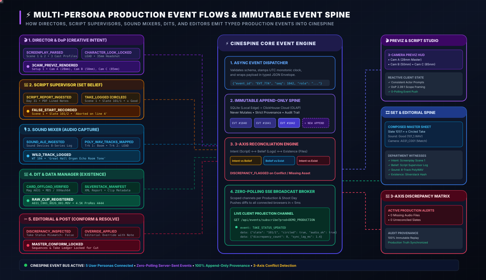
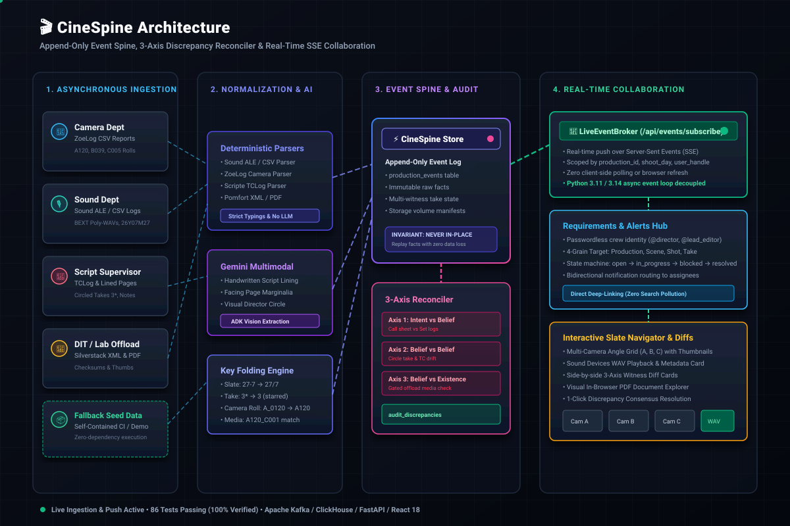
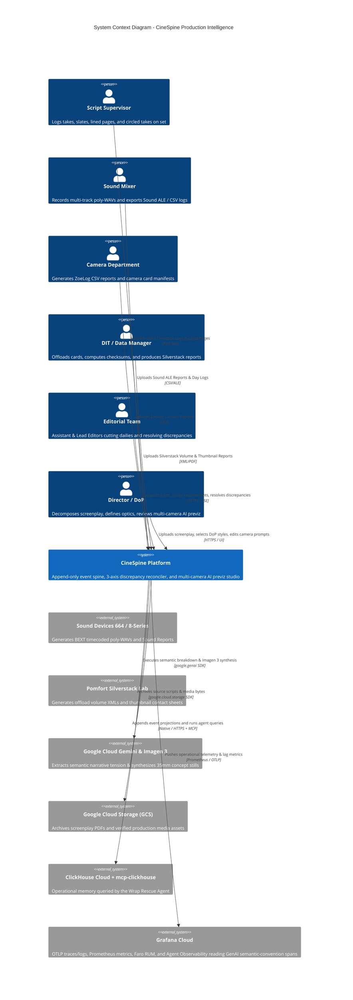
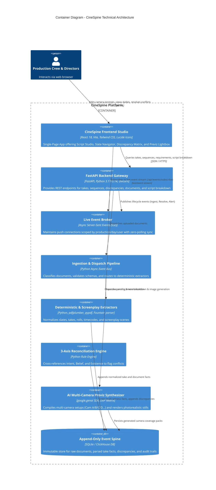
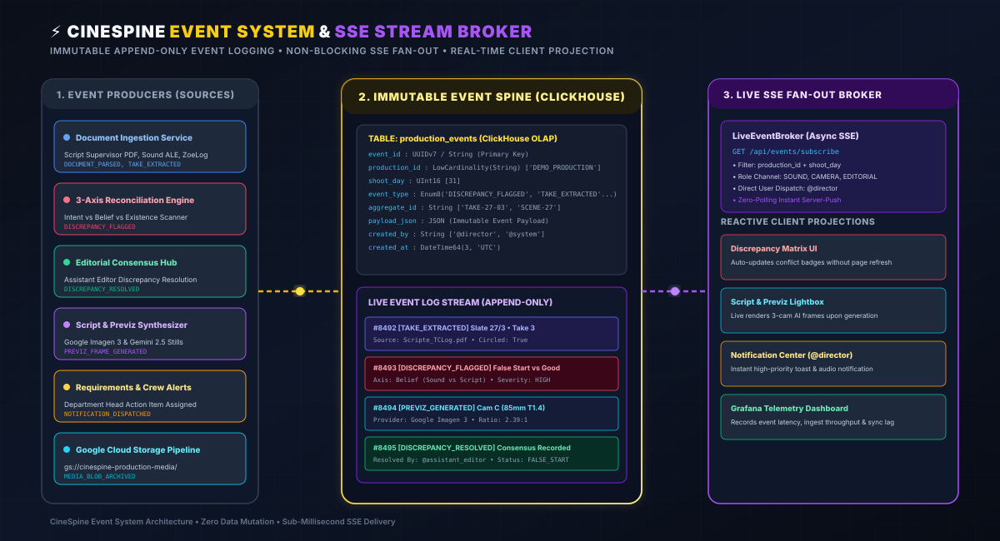
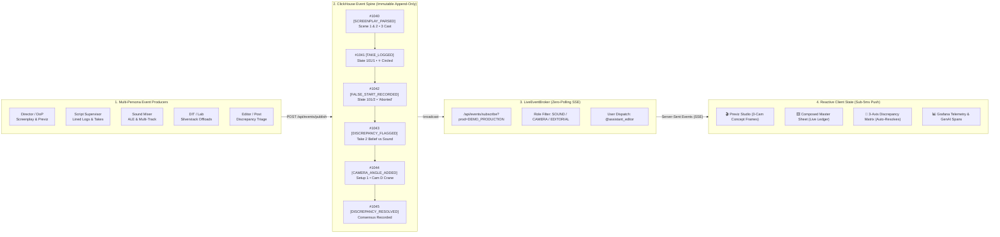
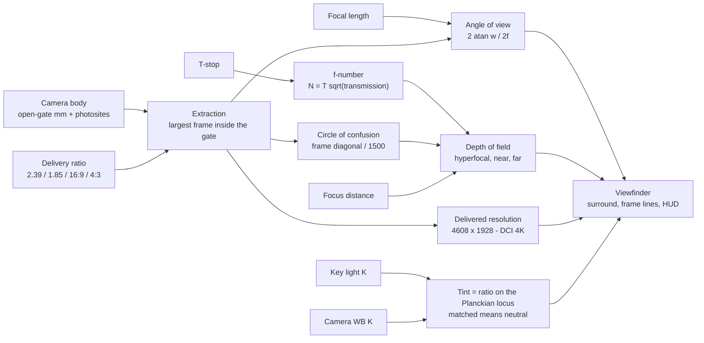

# 🎬 CineSpine

> **The Autonomous Append-Only Event Spine, 3-Axis Discrepancy Engine & Multi-Camera AI Previz Studio for Film & TV Production**  
> *Submitted to [Agentic Cinema: The Blockbuster Hackathon](https://agentic-cinema.devpost.com/) (Google Cloud & Partner Ecosystem: ClickHouse, Grafana Labs, Replit).*

[](https://github.com/ftenaf/cinespine/actions)
[](https://python.org)
[](https://cloud.google.com/vertex-ai)
[](https://clickhouse.com)
[](https://grafana.com)
[](https://cinespine-35447568692.europe-west4.run.app)
[](https://vitejs.dev)
[](https://opensource.org/licenses/MIT)

**▶ Live: [cinespine-35447568692.europe-west4.run.app](https://cinespine-35447568692.europe-west4.run.app)** — one Cloud Run service serving the API and the SPA from a single origin. See [docs/CLOUD_RUN_DEPLOY.md](docs/CLOUD_RUN_DEPLOY.md).

---

## 🌟 Executive Summary & The Problem Space

In motion picture and episodic television production, **the bottleneck is never the creative talent—it is the catastrophic breakdown of documentation, communication, and handoffs between departments.**

Every department maintains its own version of reality:
* **The Office (Intent):** Screenplay scenes, call sheets, one-liners, actor schedules, and planned shot lists.
* **The Set (Belief):** Script supervisor logs, camera logs (*parte de cámara*), sound reports (*parte de sonido*), and false take notes.
* **The Lab / DIT (Existence):** Verified camera raw clips, offload checksum manifests, multi-track poly-WAVs, and editorial conforms.

When a script supervisor notes a take as *False Start*, but the sound recordist files it as *Good*, or when a roll spelling typo (`A120` vs `A_0120`) silently drops audio tracks, **no computer crashes.** The mistake sits undetected for weeks until the editorial conform, creating emergency panic and costing studios hundreds of thousands of dollars in re-shoots.

**CineSpine** solves this by enforcing a single immutable truth:  
> *"A document is a witness. Witnesses disagree, and **the disagreement is the product**."*

### 🏛️ Animated System Architecture & C4 Model

### 1. Multi-Persona User Event Flows & Append-Only Event Spine


### 2. End-to-End System Architecture (Production to Cloud)


> *See [`docs/ARCHITECTURE.md`](docs/ARCHITECTURE.md) for full C4 Level 1–4 diagrams and sequence flows.*

### Level 1: System Context Diagram



---

### Level 2: Container Diagram



---

## ⚡ Multi-Persona Production Event Flows (By User Type)

Every department on a film set acts as an **independent witness**. When a user interacts with CineSpine, their action is packaged into an **immutable, monotonically sequenced, typed event envelope**:

```json
{
  "event_id": "EVT_99482_A",
  "sequence_num": 1042,
  "timestamp_utc": "2026-08-26T09:00:00.000Z",
  "production_id": "DEMO_PRODUCTION",
  "shoot_day": "Day 31",
  "user_role": "SCRIPT_SUPERVISOR",
  "user_id": "script_sup_1",
  "event_type": "TAKE_LOGGED",
  "payload": {
    "scene_number": "1",
    "slate": "101/1",
    "take_number": 1,
    "status": "GOOD",
    "circled": true,
    "director_notes": "Print it. Great emotional delivery from LEAD."
  }
}
```

### Event Taxonomy Across Production Roles:

| User Type / Role | Emitted Event Types | Description & Semantic Payload | Target Subsystems |
| :--- | :--- | :--- | :--- |
| **🎬 Director & DoP** | `SCREENPLAY_PARSED`<br/>`CHARACTER_LOOK_LOCKED`<br/>`3CAM_PREVIZ_RENDERED`<br/>`CAMERA_ANGLE_ADDED`<br/>`CAMERA_ANGLE_DELETED`<br/>`DOP_OPTICS_CONFIGURED` | Uploads script (`.fountain`, `.md`, `.pdf`), extracts cast profiles, adjusts optical framing ($2.39:1$), spawns extra angles (Crane Cam D, Macro Cam E), and renders Imagen 3 concept stills. | Screenplay Previz Studio, Cast Profiler, Optical Viewfinder |
| **📝 Script Supervisor** | `SCRIPT_REPORT_INGESTED`<br/>`TAKE_LOGGED`<br/>`CIRCLED_TAKE_FLAGGED`<br/>`FALSE_START_RECORDED`<br/>`DIRECTOR_NOTE_APPENDED` | Logs lined pages, continuity notes, False Starts, and circled takes on set. Asserts the "Set Belief" axis. | 3-Axis Reconciliation Engine, Composed Master Sheet |
| **🎙️ Sound Mixer** | `SOUND_ALE_INGESTED`<br/>`POLY_WAV_TRACKS_MAPPED`<br/>`WILD_TRACK_LOGGED`<br/>`TIMECODE_SYNC_ASSERTED` | Ingests Sound Devices 8-Series BEXT logs, maps ISO tracks (Boom, Lav 1, Lav 2), logs Wild Tracks (`WT 104`), asserts audio existence. | Card & Roll Map, Sequences Matrix, Audio Verifier |
| **💾 DIT & Data Manager** | `CARD_OFFLOAD_VERIFIED`<br/>`SILVERSTACK_MANIFEST_INGESTED`<br/>`CHECKSUM_VALIDATED`<br/>`RAW_CLIP_REGISTERED` | Offloads camera magazines ($A031$), computes MD5/XXHash64 checksums, parses Silverstack XML manifests, asserts "Physical Existence" axis. | Master Sheet, Roll Map, Storage Verifier |
| **✂️ Editor & Post Supervisor** | `DISCREPANCY_INSPECTED`<br/>`OVERRIDE_APPLIED`<br/>`CONSENSUS_REACHED`<br/>`MASTER_CONFORM_LOCKED` | Inspects 3-Axis conflicts (e.g. False Start vs Good, missing audio roll), overrides with editorial audit rationale, and locks master conform ledger. | Discrepancy Hub, Master Sheet, Editorial Export |
| **🤖 Autonomous Sentinel (Lighthouse)** | `3AXIS_SCAN_COMPLETED`<br/>`SYNC_LAG_ALERTED`<br/>`TELEMETRY_EMITTED` | Background event loop continuously scanning Intent ⟷ Belief ⟷ Existence for silent omissions and pushes lag telemetry to Grafana Labs. | Grafana Dashboards, Crew Alert Notifications |

---

### ⚡ Event System & Real-Time SSE Broker Architecture





---

### ✨ Core Innovations & Capabilities

### 1. 🎬 Dual-Pillar Architectural Experience
CineSpine decouples filmmaking operations into two distinct, distraction-free hero workspaces:
* **Pillar 1: 🎬 Screenplay & Previz Studio**: A pristine creative cockpit for Directors, Screenwriters, and Cinematographers to decompose scripts, profile actors, configure optics, and generate multi-angle camera concepts.
* **Pillar 2: 🎞️ Set & Editorial Spine**: An analytical operational hub for DITs, Script Supervisors, Sound Recordists, and Assistant Editors featuring the Composed Master Sheet, Sequences Log Matrix, Card & Roll Map, Active Discrepancies Hub, and DIT search engine.

### 2. 🎥 AI-Cam Breakdown & Master DoP Studio
* **Multi-Format Screenplay Ingestion:** Parses `.fountain`, `.md` (Markdown), `.txt` (Plaintext), `.pdf`, and `.fdx` (Final Draft) scripts.
* **Transition-Aware Scene Breakdown (`CUT TO:` Support):** Automatically detects screenplay transition slugs (e.g. `CUT TO:`, `SMASH CUT TO:`, `MATCH CUT TO:`, `DISSOLVE TO:`, `CUT TO BLACK.`) as explicit shot boundaries. CineSpine divides the scene into sequential shot setups matching the script's visual cuts, inferring shot dynamics (e.g. Close-Ups, Over-The-Shoulder, Wide Masters) for each cut segment.
* **Autonomous & Dynamic Multi-Camera Rig Management:**
  * Generates synchronized **Camera A** ($28\text{mm}$ Wide Master), **Camera B** ($50\text{mm}$ Medium / OTS), and **Camera C** ($85\text{mm}$ Profile / Macro).
  * **Add & Remove Cameras Dynamically:** Add **Camera D (Crane / Wide POV)**, **Camera E (Extreme Close-Up Macro)**, or **Camera F (Steadicam)** per scene, or remove unneeded cameras with automatic re-focusing.
  * **1-Click Batch Render:** Render concepts for all cameras ($A, B, C, D\dots$) simultaneously in parallel.
  * **DoP Framing & Master Optical Controls — computed, not decorative:**
    * **Real sensor geometry.** Each camera body carries its published open-gate dimensions and photosite count. Choosing an aspect ratio computes the largest frame that actually fits inside the gate, and reports what it costs: `2.39:1` on an ALEXA 35 extracts `27.99 × 11.71 mm`, uses `60.9%` of the gate (width-limited) and delivers `4608 × 1928` (DCI 4K). Switch to `4:3` and the extraction becomes height-limited at `91.6%`.
    * **Angle of view from the extraction**, not a lookup table: `2·atan(w / 2f)`. A 35→85mm change punches in by the correct `2.43×` and moves horizontal AoV from `43.6°` to `17.1°`.
    * **Real-Time Visual Depth of Field Simulator.** Inspired by the Canon Outside of Auto simulator, CineSpine features a live CSS `backdrop-filter` masked overlay that dynamically blurs the background of your images. It calculates the true physical diameter of the *Circle of Confusion* for an object at infinity ($c = f^2 / (N \times s)$) and translates it to pixels.
    * **Camera-Specific DoP Overrides:** Need the A-Cam to use a clean neutral profile but the B-Cam to emulate an 85mm anamorphic vintage look? CineSpine supports custom side-panel overrides per camera.
    * **Custom DoP Presets:** Dial in the perfect matrix of focal length, T-stop, Kelvin, and lighting ratios, and save them as reusable "Custom Presets" natively in the frontend to quickly deploy across your shot list.
  * **Dynamic Cast Profiler:** Auto-extracts character descriptions from your uploaded script and standardizes appearance, age, and attire to ensure temporal character consistency across all generated AI shots.


* **AI Character Profiling & Consistency:**
  * On ingestion, each character's dialogue, parentheticals, the action lines naming them and the settings they appear in are gathered as evidence and sent to Gemini, which returns their **role and archetype, physical appearance, costume and props, and facial features**.
  * Output is **validated, not trusted**: descriptions are checked for filler words, placeholder phrasing, minimum length and the presence of at least one concrete noun. Anything too generic to render gets one targeted retry, and anything still vague is reported rather than passed off as good.
  * Profiles are **editable and durable** — stored in SQLite against a script identity derived from the screenplay text, so hand-authored looks survive a re-upload *and* a backend restart. Structural data (dialogue counts, scene presence, relationships) refreshes from each parse while your edits win.
  * Every generated frame is prompted with **only the characters present in that scene**.
* **Dynamic Gemini Routing for Optimal Token Cost:**
  * To run cost-effectively, especially during intensive hackathons, CineSpine implements a dynamic Gemini router. Trivial semantic tasks route to Flash models, while massive context analysis can opt into Pro models only when required.

### 3. 🔍 3-Axis Discrepancy Reconciliation Engine
* Reconciles Intent (Planned), Belief (Logged on set), and Existence (Stored on disk) with sub-millisecond precision.
* Catches silent false starts, unlinked audio tracks, timecode drift, roll name collisions, and missing coverage.
* Features an interactive **Consensus & Resolution Triage Hub** for Assistant Editors, DITs, and Post Supervisors.

### 3.5 🤖 Wrap Rescue Agent for the ClickHouse Track
The production hub includes a **Run Wrap Rescue Agent** action built for the ClickHouse hackathon track.
It projects the latest CineSpine state into ClickHouse, calls the official `mcp-clickhouse` server for
`list_tables` and `run_select_query`, ranks active blockers by severity, age and missing acknowledgement,
then creates or updates requirement cards with notifications and an append-only audit event.

The UI shows the judge-visible trace: MCP connection status, SQL/tool calls, ranked blockers,
requirement actions, and the final Gemini Enterprise handoff memo. In the demo story, Day 31 has a
paperwork conflict, missing offload, and unacknowledged sound blocker; ClickHouse is the operational
memory the agent queries before deciding who must act.

### 3.6 ✂️ Assistant Editor Queue Agent
Every active production has a managed crew roster and an **Assistant Editorial** panel. While a production
is still active, post supervisors can add, deactivate, or remove crew members from a phase-grouped
postproduction-first role dropdown that assigns each role to its operational department, then run a deterministic
queue agent for one day or **all days with unassigned clean work**: script/camera/sound paperwork present,
offload evidence present, and no active discrepancies or blocking requirements. The agent balances scene-level
end-of-day requirements across all active assistant editors. Each assigned assistant can mark their scene
complete, resolving the requirement with `resolved_by` and `resolved_at` audit fields, and the production
dashboard shows pre-editing progress by assistant with a completion chart. The same dashboard also includes
a production-wide **Crew Workload** view so coordinators can see every crew member's active requirements,
blocked items, completed count and current task targets at a glance. Beside it, an **Activity** card reads
the activity ledger every mutation route writes: changes made and things viewed per person and shoot day,
kept apart on purpose, plus the median time from a requirement being raised to its assignee first touching
it. It counts actions, not effort, and says so.

### 4. 📡 Append-Only Event Spine & Real-Time SSE Bus
* Backed by **ClickHouse** and SQLite for zero-data-loss event streaming.
* Real-time Server-Sent Events (SSE) dispatching live updates to crew members based on department handle (`@director`, Sound, Camera, Editorial).

---

## ☁️ Google Cloud & Partner Integration (Runtime Verified)

CineSpine executes real runtime API calls to Google Cloud and partner services:

```python
# 1. Official Google GenAI SDK Runtime Import
from google import genai
from google.genai import types as genai_types

# Gemini Screenplay Semantic Breakdown.
# llm_router returns an ordered list of candidates rather than one name, so a
# retired version or an exhausted per-model quota falls through instead of
# failing the request. Every id is a real Model Garden publisher model: Vertex
# publishes no floating "-latest" alias, and asking for one 404s exactly the
# way a retired pin does.
from backend.app.script.llm_router import get_model_candidates

client = genai.Client(api_key=os.getenv("GEMINI_API_KEY"))
for model in get_model_candidates(prompt, task_complexity="simple"):
    try:
        analysis = client.models.generate_content(model=model, contents=prompt)
        break
    except Exception:
        continue  # 404 retired / 429 quota / 503 overloaded -> next candidate

# Google Imagen 3 Photorealistic 35mm Previz Synthesis
result = client.models.generate_images(
    model="imagen-3.0-generate-002",
    prompt=compiled_dop_prompt,
    config=dict(number_of_images=1, aspect_ratio="16:9")
)

# 2. Official Google Cloud Storage (GCS) Media Ingest
from google.cloud import storage as gcs_storage
gcs_client = gcs_storage.Client(project="cinespine-agentic-cinema")
blob = gcs_client.bucket("cinespine-production-media").blob("screenplays/scene_27.pdf")
blob.upload_from_string(file_bytes, content_type="application/pdf")
```

| Partner / Service | Role in CineSpine | Verification |
| :--- | :--- | :--- |
| **Google Cloud (Gemini Enterprise)** | Screenplay semantic analysis, cast inference, DoP prompt compilation, and Wrap Rescue memo drafting | Wrap Rescue prefers `google-adk` / Gemini Enterprise Agent Platform runtime, with Vertex AI or Gemini credentials for model calls |
| **Google Cloud (Imagen 3)** | Photorealistic 35mm cinematic concept art generation | Model `imagen-3.0-generate-002` |
| **Google Cloud Storage (GCS)** | Screenplay PDF & high-res media archival | Bucket `gs://cinespine-production-media/` |
| **ClickHouse** | Agent-queryable operational memory | Official `mcp-clickhouse` tool calls plus event projections |
| **Grafana Cloud** | OTLP traces and logs, Prometheus metrics, Faro RUM, and [Agent Observability](https://grafana.com/docs/grafana-cloud/observe-and-act/agent-observability/) for the ADK agents | `GoogleGenAiSdkInstrumentor` emits OTel GenAI semantic-convention spans for `generate_content` and `execute_tool` — the shape Agent Observability reads for generations, tool calls and token usage. See [docs/OBSERVABILITY.md](docs/OBSERVABILITY.md) |

---

### 📡 Observability

Telemetry reaches Grafana Cloud from the backend and the browser, and the
agents are legible rather than opaque:

* **Traces and logs are correlated.** `LoggingInstrumentor` stamps every log
  record with the active span, so a production log line carries
  `trace_id=… trace_sampled=True` and pastes straight into Grafana.
* **Agent observability** via `opentelemetry-instrumentation-google-genai`.
  Wrap Rescue and the Assistant Editor Queue run on Google ADK and reach Gemini
  through the google-genai SDK; `generate_content` and `execute_tool` are
  traced, so an agent run is a span tree instead of one opaque HTTP request.
  This replaced OpenLIT, which hard-depends on `anthropic`, `openai` and
  `boto3` — three vendor SDKs nothing here calls — and spent ~34s at init
  patching them all. Attaching now costs 0.00s and the image is 39 MB smaller.
* **Business metrics** as OTel instruments (`cinespine_*`) — discrepancies by
  day and severity, ingested events by department and axis, parser rejections,
  cache hits, live SSE connections — pushed with the traces, not scraped.
* **Faro RUM** from the SPA, with the caveat that costs the most time: the
  collector's allowed-origins list must contain **every** origin serving the
  app, and Cloud Run issues two hostnames per service. A rejected preflight is
  invisible from both ends — the frontend appears not to send and Grafana
  appears not to receive.

---

## 🚀 Quickstart Guide

### Prerequisites
- **Python 3.11+** (or Python 3.14)
- **Node.js 18+** & `npm`

### 1. Clone & Setup Backend
```bash
git clone https://github.com/ftenaf/cinespine.git
cd cinespine

# Installs uv itself if you don't have it: https://docs.astral.sh/uv/getting-started/installation/
uv sync --extra dev
```

> **Dependencies are declared once, in `pyproject.toml`, and pinned in `uv.lock`.** `uv sync` creates
> `.venv` and installs both from the lock — no separate `pip install -r` step, and nothing to
> hand-edit. This is the same lock `Dockerfile.cloudrun` and `backend/Dockerfile` install from, so a
> local run, CI and the deployed image all resolve identically. After changing `pyproject.toml`,
> regenerate the lock:
>
> ```bash
> uv lock
> ```
>
> Prefix any command with `uv run` to use the project's `.venv` (e.g. `uv run pytest`,
> `uv run uvicorn backend.app.main:app --reload`), or activate it directly:
> `source .venv/bin/activate` (Linux/macOS) / `.\.venv\Scripts\activate` (Windows).

### Configuration

Copy `.env.example` to `.env` and fill in what you need. Everything is optional — the app runs without
any of it, degrading gracefully rather than failing.

| Variable | Default | What it does |
|---|---|---|
| `GEMINI_API_KEY` | *unset* | Enables AI character inference and image generation. Without it, character profiles fall back to what the script literally states and the UI says so. |
| `CINESPINE_GEMINI_MODEL` | `gemini-3.6-flash` | Model used for character inference. |
| `CINESPINE_AI_CHARACTER_TIMEOUT` | `60` | Seconds before inference is abandoned. A timeout discards the whole inference, so leave headroom: measured round trips on a five-scene script are 22–27s. |
| `CINESPINE_DISABLE_AI_CHARACTER_INFERENCE` | *unset* | Set to `1` to skip inference entirely. Useful for offline work and required for a hermetic test run. |
| `CINESPINE_DB_PATH` | `spine.db` | SQLite file holding screenplays and character profiles. Relative to the working directory, so set an absolute path for a deployment. |
| `CINESPINE_EXAMPLES_DIR` | `data/examples` | Local folder of example production paperwork. Nothing is committed — see the note below. |
| `GOOGLE_CLOUD_PROJECT` / `GCS_BUCKET_NAME` | demo values | Google Cloud Storage archival target. |
| `CINESPINE_GEMINI_FLASH_MODEL` | `gemini-2.5-flash` | First candidate `llm_router` returns. The fallbacks after it are separate quota pools, so a 429 or 503 on one still has somewhere to go. |
| `CLICKHOUSE_MCP_URL` | *unset* | Official `mcp-clickhouse` HTTP endpoint for the Wrap Rescue Agent, for example `http://localhost:4200/mcp`. Point it at your own server: ClickHouse Cloud's hosted MCP is OAuth-only and cannot be reached headlessly. |
| `CLICKHOUSE_MCP_AUTH_TOKEN` | *unset* | Bearer token sent to that server. Required unless the server runs with auth disabled. |
| `GOOGLE_GENAI_USE_VERTEXAI` | *unset* | Set to `TRUE` to run Gemini calls through Vertex AI / Gemini Enterprise credentials. Note that Vertex publishes **no `-latest` aliases** — every model id must be a real Model Garden publisher model. |
| `CINESPINE_WRAP_RESCUE_MODEL` | *unset* | Gemini model used for the Wrap Rescue handoff memo, for example `gemini-2.5-flash`. |
| `CINESPINE_DISABLE_GENAI_TELEMETRY` | *unset* | Set to `1` to skip GenAI span instrumentation. It attaches inline in 0.00s, so there is rarely a reason to. |

> **Real production paperwork is never committed.** Call sheets, camera reports and script logs are
> third-party copyrighted material and routinely carry crew personal data, so `data/examples/`,
> `data/raw/` and `*.pdf` are gitignored. Point `CINESPINE_EXAMPLES_DIR` at a local copy to enable the
> PDF integration tests, which skip by default.
>
> The synthetic `DEMO_*` fixtures are the one exception and **are** tracked, via negations in
> `.gitignore`. They have to be: the demo endpoint reads them by filename and skips what is missing, so
> while they were ignored a fresh clone ingested no offload evidence and still reported success. What
> those files must satisfy for reconciliation to show anything is written down in
> [docs/DEMO_DATA.md](docs/DEMO_DATA.md).

### 2. Start the Backend API Server
```bash
uv run uvicorn backend.app.main:app --host 0.0.0.0 --port 8000 --reload
```
* Backend API Gateway: `http://localhost:8000`
* Interactive API Docs: `http://localhost:8000/docs`
* Google Cloud Telemetry: `http://localhost:8000/api/integrations/google-cloud`

### 3. Setup & Start Frontend Studio
```bash
cd frontend
npm install
npm run dev
```
* Studio UI: `http://localhost:5173`

---

## 🔌 Script Studio API

| Endpoint | Purpose |
|---|---|
| `POST /api/script/upload` | Upload `.fountain` / `.md` / `.txt` / `.pdf` / `.fdx`. Parses scenes and cast, runs AI character inference, stores the result. |
| `POST /api/script/parse` | Same, from raw text instead of a file. |
| `GET /api/script/{script_id}/characters` | Read stored character profiles, including edits. |
| `POST /api/script/characters/update` | Persist edits to one character. Requires `script_id`; answers `404` for an unknown character rather than reporting a success that did not happen. |
| `POST /api/script/characters/generate-portrait` | Photorealistic 85mm portrait locking a character's likeness. |
| `POST /api/script/breakdown` | Scene → multi-camera shot proposals. |
| `POST /api/script/generate-storyboard` | Render a camera frame. |

Every parse returns a **`script_id`** derived from the screenplay text, plus **`parse_warnings`**.

The `script_id` is what makes edits durable: re-uploading the same screenplay resolves to the same id, so
previously saved profiles are reattached rather than regenerated.

`parse_warnings` is how a poor parse explains itself instead of presenting as success — no scene headings
found, no character cues detected, inference unavailable, or descriptions that stayed generic after a
retry. The UI surfaces them as an amber banner.

---

## 🧪 Automated Test Suite

```bash
uv run pytest
```

```
975 passed, 11 skipped in 100s
```

The 11 skips are environmental, not silent failures: seven need real production
PDFs that `.gitignore` deliberately excludes, two are parsers refusing a
document shape, and two need ClickHouse or TLS environment variables.

> A green suite is not evidence the deployed stack works. Nothing here reads
> `data/examples/`, and the Wrap Rescue tests use a fake MCP client — which is
> how a client asking for a tool the server does not export stayed green for a
> long time. [docs/CLICKHOUSE_MCP.md](docs/CLICKHOUSE_MCP.md) records what that
> transport actually guarantees and how to check it against a running server.

The frontend suite covers the optics module — sensor geometry, angle of view,
depth of field and the blur simulator:

```bash
cd frontend && npm test
```

```
Test Files  1 passed (1)
     Tests  49 passed (49)
```

Coverage by area:

| Suite | Tests | Covers |
|---|---|---|
| `test_character_ai.py` | 22 | Evidence gathering, prompt contract, response parsing, the vagueness validator and its retry, every inference failure path |
| `test_script_studio.py` | 17 | Screenplay parsing, title-block handling, character persistence, restart durability |
| `test_normalizers.py` | 16 | Roll, slate, take and shoot-day normalisation |
| `test_api.py` | 9 | REST surface, seeding, sequences |
| `test_google_cloud_integration.py` | 8 | SDK availability, and that the real and fallback paths are distinguishable |
| `test_reconciliation.py` | 8 | 3-axis discrepancy detection |
| `test_parsers.py` / `test_pdf_parsers.py` / `test_scripte_parsers.py` | 16 | Camera CSV, sound ALE, Silverstack and Scripte log parsing |
| *others* | 46 | Classification, streaming, requirements, previews, agents |

**The 7 skips are deliberate.** `test_real_pdf_examples.py` exercises parsing against real production
PDFs, which are copyrighted and not committed. Point `CINESPINE_EXAMPLES_DIR` at a local set to run them.

Two properties worth knowing:

* **The suite is hermetic.** `main.py` loads `.env`, so once a real `GEMINI_API_KEY` is present every
  test touching `/api/script/upload` would otherwise make a live, billed call — roughly 25 seconds each,
  and failing offline. A fixture disables inference by default; tests that exercise it opt in explicitly
  and stub the model.
* **The AI tests are falsifiable.** The vagueness validator is calibrated against eleven cases in both
  directions, and the inference tests assert *which* code path ran rather than that a call returned
  something.

---

## 📂 Project Structure

```
cinespine/
├── pyproject.toml                       # Single source of dependency truth
├── uv.lock                              # Compiled lock (generated — do not edit)
├── backend/
│   ├── app/
│   │   ├── main.py                      # FastAPI application gateway
│   │   ├── api/routes.py                # REST & SSE gateway
│   │   ├── agents/                      # multimodal extractors and Wrap Rescue Agent
│   │   ├── core/telemetry.py            # Prometheus metrics
│   │   ├── integrations/
│   │   │   └── google_cloud.py          # google-genai & GCS client
│   │   ├── normalizers/                 # Roll, slate, take, shoot-day normalisation
│   │   ├── parsers/                     # Camera CSV, sound ALE, Silverstack, PDF, classifier
│   │   ├── reconciliation/              # 3-axis engine, models, timecode
│   │   ├── script/
│   │   │   ├── parser.py                # Screenplay parser (.fountain/.md/.txt/.pdf/.fdx)
│   │   │   ├── character_ai.py          # AI character inference + vagueness validator
│   │   │   ├── breakdown_engine.py      # Multi-camera coverage engine
│   │   │   ├── dop_presets.py           # Master DoP style presets
│   │   │   ├── ai_image_service.py      # Google Imagen generation
│   │   │   └── storyboard_generator.py  # 35mm still generator
│   │   ├── spine/
│   │   │   ├── writer.py                # Append-only event & document store
│   │   │   ├── character_store.py       # Durable character profiles (SQLite)
│   │   │   └── schema.py
│   │   └── streaming/                   # SSE broker, event bus, dispatcher
│   └── tests/                           # 142 pytest tests + conftest fixtures
├── frontend/
│   ├── src/
│   │   ├── App.tsx                      # Set & Editorial Spine (root application)
│   │   ├── components/ScriptStudio.tsx  # Screenplay, cast profiler & DoP Studio
│   │   ├── optics.ts                    # Sensor geometry, angle of view, depth of field
│   │   ├── api.ts / types.ts
│   └── package.json
├── docs/
│   ├── ARCHITECTURE.md                  # C4 model + event spine
│   ├── DEVPOST_SUBMISSION.md            # Hackathon submission package
│   ├── GOOGLE_CLOUD_INTEGRATION.md      # Google Cloud architecture guide
│   ├── DEMO_VIDEO_SCRIPT.md             # Demo walkthrough script
│   └── architecture/                    # C4 doc + animated SMIL SVG diagrams
└── README.md
```

---

## 📜 License & Acknowledgments

* **License:** [MIT License](LICENSE)
* **Hackathon:** Built for [Agentic Cinema: The Blockbuster Hackathon](https://agentic-cinema.devpost.com/)
* **Created by:** Francisco & The CineSpine Team
