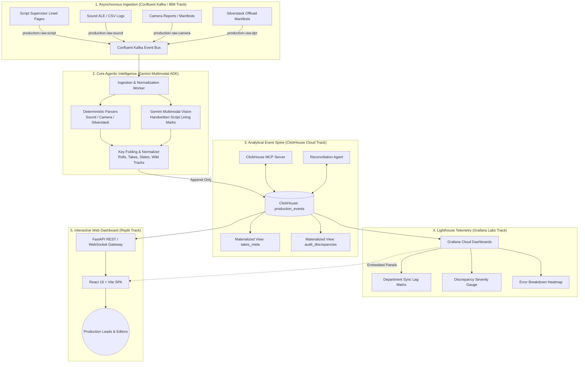

# 🎬 CineSpine

> **The Append-Only Event Spine & 3-Axis Discrepancy Reconciliation Engine for Film & TV Production**

[](https://github.com/ftenaf/cinespine/actions)
[](https://opensource.org/licenses/MIT)

---

## 📖 The Problem

Film and television productions run on fragmented daily paperwork created by five different departments across set and post-production. Every department keeps its own truth in its own silo:
* **Office:** Call sheets and Daily Production Reports (*parte de producción*) $\rightarrow$ **Intent**
* **Set:** Camera reports (*parte de cámara*), Sound ALE/CSV logs, Script supervisor notes and lined pages $\rightarrow$ **Belief**
* **Post / DIT:** Silverstack volume checksums, offload reports, clip manifests $\rightarrow$ **Existence**

Every handoff loses information, and **witnesses disagree**. An editor looking for take 3 on camera roll `B039` can discover the take was filed as `B39` by an unpadded script export, split into two separate rolls, and marked with a 4-frame timecode drift.

**CineSpine** solves this not by forcing a single fragile view, but by embracing the core truth: **The disagreement is the product.**

---

## 🏛️ System Architecture



---

## ⚙️ Core Invariants & Engineering Principles

1. **The Spine is Append-Only:** Correcting a fact appends a newer event with a later timestamp; never mutate rows in place.
2. **Absence of Report $\neq$ Absence of Material:** A day nobody has offloaded yet must never be rendered as missing footage. Gated on offload coverage.
3. **The Confident Nothing is the Enemy:** Any parser producing zero rows on non-empty input raises an explicit rejection (`PARSER_FAILURE`).
4. **Machine-Generated Data is Never Parsed by LLMs:** Timecodes, checksums, and roll IDs are extracted with strict deterministic validators. Gemini Multimodal is reserved for handwritten script lining and visual assets.

---

## 🚀 Quickstart

### Prerequisites
* Python 3.11+
* Node.js 20+
* Docker & Docker Compose (for local ClickHouse & Kafka)

### 1. Start Local Infrastructure
```bash
docker compose up -d
```

### 2. Backend Setup
```bash
cd backend
python -m venv .venv
source .venv/bin/activate  # Or .venv\Scripts\Activate on Windows
pip install -r requirements.txt
pytest -v  # Run test suite
uvicorn app.main:app --reload --port 8000
```

### 3. Frontend Setup
```bash
cd frontend
npm install
npm run dev
```

Open [http://localhost:5173](http://localhost:5173) in your browser.

---

## 🧪 Vertical Slices & TDD Roadmap

* **Slice 1: Identity Normalization & Deterministic Parsers (TDD)**
* **Slice 2: Confluent Kafka Event Bus & Ingestion Stream**
* **Slice 3: ClickHouse Append-Only Spine & 3-Axis Reconciliation Engine**
* **Slice 4: Gemini Multimodal Script Extractor & MCP Tools**
* **Slice 5: Grafana Lighthouse Telemetry**
* **Slice 6: Full-Stack React Diff Surface & Replit Deployment**
