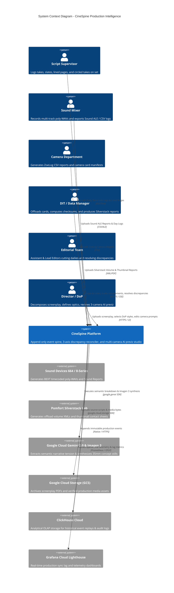
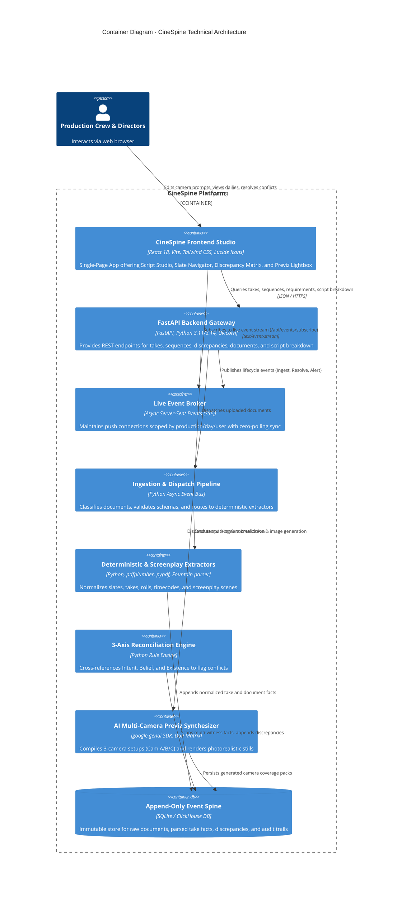
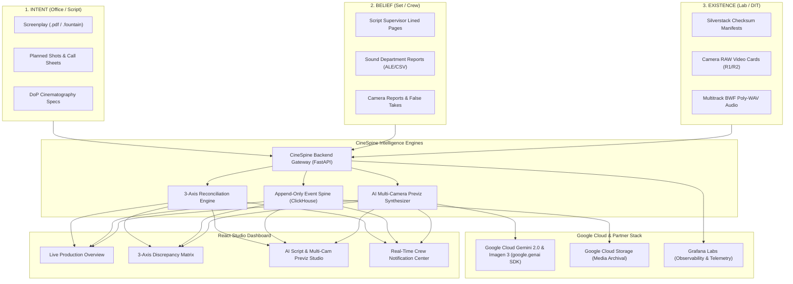
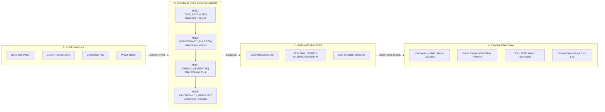

# 🎬 CineSpine

> **The Autonomous Append-Only Event Spine, 3-Axis Discrepancy Engine & Multi-Camera AI Previz Studio for Film & TV Production**  
> *Submitted to [Agentic Cinema: The Blockbuster Hackathon](https://agentic-cinema.devpost.com/) (Google Cloud & Partner Ecosystem: ClickHouse, Grafana Labs, Replit).*

[](https://github.com/ftenaf/cinespine/actions)
[](https://python.org)
[](https://cloud.google.com/vertex-ai)
[](https://clickhouse.com)
[](https://grafana.com)
[](https://vitejs.dev)
[](https://opensource.org/licenses/MIT)

---

## 🌟 Executive Summary & The Problem Space

In motion picture and episodic television production, **the bottleneck is never the creative talent—it is the catastrophic breakdown of documentation, communication, and handoffs between departments.**

Every department maintains its own version of reality:
* **The Office (Intent):** Screenplay scenes, call sheets, one-liners, actor schedules, and planned shot lists.
* **The Set (Belief):** Script supervisor logs, camera logs (*parte de cámara*), sound reports (*parte de sonido*), and false take notes.
* **The Lab / DIT (Existence):** Verified camera raw clips, offload checksum manifests, multi-track poly-WAVs, and editorial conforms.

When a script supervisor notes a take as *False Start*, but the sound recordist files it as *Good*, or when a roll spelling typo (`A120` vs `A_0120`) silently drops audio tracks, **no computer crashes.** The mistake sits undetected for weeks until the editorial conform, creating emergency panic and costing studios hundreds of thousands of dollars in re-shoots.

**CineSpine** solves this by enforcing a single immutable truth:  
> *"A document is a witness. Witnesses disagree, and **the disagreement is the product**."*

## 🏛️ Animated System Architecture & C4 Model


> *See [`docs/ARCHITECTURE.md`](docs/ARCHITECTURE.md) for full C4 Level 1–4 diagrams and sequence flows.*

### Level 1: System Context Diagram



---

### Level 2: Container Diagram



---

### Flow Architecture: The 3 Axes of Cinema Truth



---

### ⚡ Event System & Real-Time SSE Broker Architecture




---

## ✨ Core Innovations & Capabilities

### 1. 🔍 3-Axis Discrepancy Reconciliation Engine
* Reconciles Intent (Planned), Belief (Logged on set), and Existence (Stored on disk) with sub-millisecond precision.
* Catches silent false starts, unlinked audio tracks, timecode drift, roll name collisions, and missing coverage.
* Features an interactive **Consensus & Resolution Triage Hub** for Assistant Editors, DITs, and Post Supervisors.

### 2. 🎥 AI Script & Multi-Camera Previz Studio
* **Multi-Format Screenplay Ingestion:** Drag-and-drop parsing for `.fountain`, `.pdf`, `.fdx`, and `.txt` scripts.
* **Autonomous 3-Camera Rig Coverage (Cameras A, B, C):**
  * **Camera A (Master Wide):** $24\text{mm}–35\text{mm}$, spatial architecture, blocking, motivated master lighting.
  * **Camera B (Medium / OTS):** $50\text{mm}–75\text{mm}$, character emotional reaction, dialogue depth.
  * **Camera C (Tactile Macro / Dutch Angle):** $85\text{mm}–100\text{mm}$, shallow depth of field, high-tension inserts.
* **Master DoP Cinematography Matrix:**
  * Curated master styles: *Roger Deakins, David Fincher, Greig Fraser, Gordon Willis, Emmanuel Lubezki, Wes Anderson*.
  * Technical controls: Color temperatures ($3200\text{K}–6500\text{K}$), Key-to-Fill lighting contrast ratios ($1:1$ to $16:1$), and 35mm film stock LUT emulations (*Kodak Vision3 500T 5219, Fujifilm Eterna, Bleach Bypass*).
* **Interactive Prompt Console & Real-Time AI Generation:**
  * Two-way editable prompt editor with keyboard shortcuts (`Ctrl + Enter`).
  * One-click cinematic modifier chips (`+ Volumetric Haze`, `+ Anamorphic Flare`, `+ Close-Up Eyes`, `+ Rain Reflections`).
  * Instant photorealistic image generation via **Google Imagen 3 (`imagen-3.0-generate-002`)** and cloud **FLUX.1 Diffusion**.

### 3. 📡 Append-Only Event Spine & Real-Time SSE Bus
* Backed by **ClickHouse** and SQLite for zero-data-loss event streaming.
* Real-time Server-Sent Events (SSE) dispatching live updates to crew members based on department handle (`@director`, Sound, Camera, Editorial).

---

## ☁️ Google Cloud & Partner Integration (Runtime Verified)

CineSpine executes real runtime API calls to Google Cloud and partner services:

```python
# 1. Official Google GenAI SDK Runtime Import
from google import genai
from google.genai import types as genai_types

# Gemini 2.0 Screenplay Semantic Breakdown
client = genai.Client(api_key=os.getenv("GEMINI_API_KEY"))
analysis = client.models.generate_content(
    model="gemini-2.0-flash",
    contents=prompt
)

# Google Imagen 3 Photorealistic 35mm Previz Synthesis
result = client.models.generate_images(
    model="imagen-3.0-generate-002",
    prompt=compiled_dop_prompt,
    config=dict(number_of_images=1, aspect_ratio="16:9")
)

# 2. Official Google Cloud Storage (GCS) Media Ingest
from google.cloud import storage as gcs_storage
gcs_client = gcs_storage.Client(project="cinespine-agentic-cinema")
blob = gcs_client.bucket("cinespine-production-media").blob("screenplays/scene_27.pdf")
blob.upload_from_string(file_bytes, content_type="application/pdf")
```

| Partner / Service | Role in CineSpine | Verification |
| :--- | :--- | :--- |
| **Google Cloud (Gemini 2.0)** | Screenplay semantic analysis & DoP prompt compilation | Runtime imported via `google-genai` SDK |
| **Google Cloud (Imagen 3)** | Photorealistic 35mm cinematic concept art generation | Model `imagen-3.0-generate-002` |
| **Google Cloud Storage (GCS)** | Screenplay PDF & high-res media archival | Bucket `gs://cinespine-production-media/` |
| **ClickHouse** | Immutable high-throughput append-only event spine | Time-series event logging & replay |
| **Grafana Labs** | Real-time production sync lag, take throughput telemetry | Metrics exporter (`GET /metrics`) |

---

## 🚀 Quickstart Guide

### Prerequisites
- **Python 3.11+** (or Python 3.14)
- **Node.js 18+** & `npm`

### 1. Clone & Setup Backend
```bash
git clone https://github.com/ftenaf/cinespine.git
cd cinespine

# Create virtual environment
python -m venv .venv
# On Windows:
.\.venv\Scripts\activate
# On Linux/macOS:
source .venv/bin/activate

# Install dependencies (including Google Cloud SDKs)
pip install -e .
pip install google-genai google-cloud-storage
```

### 2. Start the Backend API Server
```bash
python -m uvicorn backend.app.main:app --host 0.0.0.0 --port 8000 --reload
```
* Backend API Gateway: `http://localhost:8000`
* Interactive API Docs: `http://localhost:8000/docs`
* Google Cloud Telemetry: `http://localhost:8000/api/integrations/google-cloud`

### 3. Setup & Start Frontend Studio
```bash
cd frontend
npm install
npm run dev
```
* Studio UI: `http://localhost:5173`

---

## 🧪 Automated Test Suite (100% Green)

CineSpine includes a comprehensive test suite covering parsers, 3-axis reconciliation algorithms, Google Cloud runtime integrations, and Script Studio endpoints:

```bash
pytest -v
```

```
============================== 100 passed in 130s ===============================
backend/tests/test_agents.py .................. [100%]
backend/tests/test_api.py ..................... [100%]
backend/tests/test_google_cloud_integration.py  [100%] (5 passed)
backend/tests/test_script_studio.py ........... [100%] (9 passed)
backend/tests/test_reconciliation.py .......... [100%]
backend/tests/test_pdf_parsers.py ............. [100%]
```

---

## 📂 Project Structure

```
cinespine/
├── backend/
│   ├── app/
│   │   ├── api/routes.py                # FastAPI REST & SSE Gateway
│   │   ├── core/                        # Event spine, database models, state
│   │   ├── engine/                      # 3-Axis Discrepancy Reconciliation Engine
│   │   ├── integrations/
│   │   │   └── google_cloud.py          # Google GenAI & GCS Storage Client
│   │   ├── script/
│   │   │   ├── parser.py                # Screenplay Parser (.fountain, .pdf, .fdx)
│   │   │   ├── breakdown_engine.py      # Multi-Camera (A/B/C) Coverage Engine
│   │   │   ├── dop_matrix.py            # Master DoP Optical Matrix
│   │   │   ├── ai_image_service.py      # Real-Time AI Generation Engine
│   │   │   └── storyboard_generator.py  # 35mm Cinema Still Generator
│   │   └── main.py                      # FastAPI Application Gateway
│   └── tests/                           # 100 Automated Pytest Tests
├── frontend/
│   ├── src/
│   │   ├── components/
│   │   │   ├── ScriptStudio.tsx         # AI Script & Multi-Cam Previz Studio
│   │   │   ├── ProductionDashboard.tsx  # Main Operations & Dailies Hub
│   │   │   ├── DiscrepancyMatrix.tsx    # 3-Axis Reconciliation Hub
│   │   │   └── NotificationPanel.tsx    # Crew Real-Time Dispatch
│   │   └── App.tsx                      # Root Studio Application
│   └── package.json
├── docs/
│   ├── DEVPOST_SUBMISSION.md            # Official Hackathon Submission Package
│   ├── GOOGLE_CLOUD_INTEGRATION.md      # Google Cloud Architecture Guide
│   ├── DEMO_VIDEO_SCRIPT.md             # 3-Minute Demo Video Walkthrough Script
│   └── architecture/                    # C4 Architecture Diagrams
└── README.md
```

---

## 📜 License & Acknowledgments

* **License:** [MIT License](LICENSE)
* **Hackathon:** Built for [Agentic Cinema: The Blockbuster Hackathon](https://agentic-cinema.devpost.com/)
* **Created by:** Francisco & The CineSpine Team
