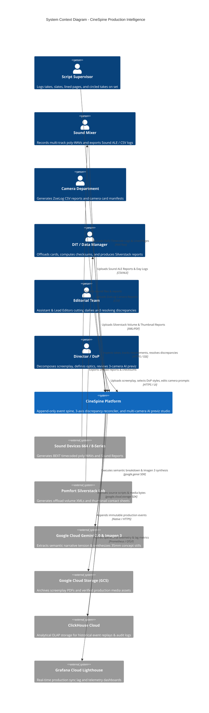
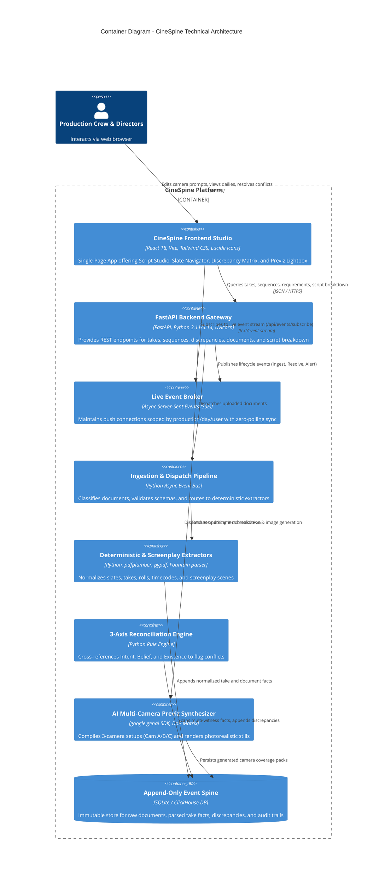
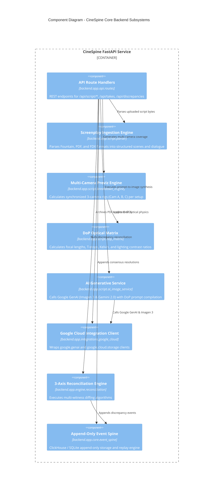
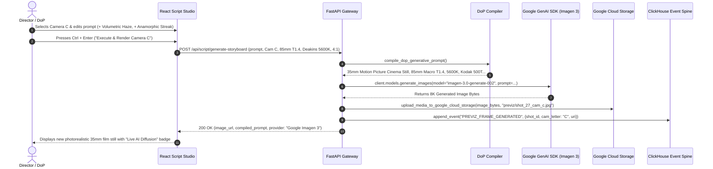
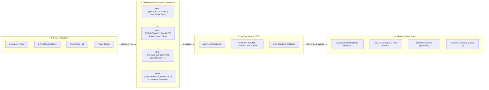

# 🏛️ CineSpine — C4 Architecture Documentation

> Comprehensive structural, container, component, and runtime sequence architecture documentation for **CineSpine** following the **C4 Model**.

---

## 🎬 Animated System Architecture & User Event Flows (SMIL SVG)

### 1. Multi-Persona User Event Flows & Append-Only Event Spine

### 2. End-to-End System Architecture (Production to Cloud)

### 3. Event System & Real-Time SSE Broker

---

## 1. Level 1: System Context Diagram
The System Context diagram illustrates CineSpine within the operational environment of a film & television production unit, showing external practitioners and external cloud ecosystems.

---

## 2. Level 2: Container Diagram
Zooms into the technical boundaries of the CineSpine platform.

---

## 3. Level 3: Component Diagram (Backend Core)
Details the internal components of the CineSpine Python FastAPI service.

---

## 4. Level 4: Dynamic Runtime Sequence Diagram
Shows the step-by-step lifecycle when a user edits a camera prompt and renders a photorealistic 35mm concept frame.

---

## ⚡ 5. Append-Only Event Spine & Live SSE Fan-Out Architecture

### Animated Event System Diagram (SMIL SVG)

### Event Sourcing & State Projection Model

### Event System Guarantees:
1. **Zero Mutation Invariant:** Events are append-only. Takes and slates are never updated in place; state is computed as a fold over historical events.
2. **Auditability & Traceability:** Every discrepancy resolution, consensus vote, and prompt modification records the originating practitioner handle (`@assistant_editor`, `@director`) and UTC timestamp.
3. **Non-Blocking Real-Time Fan-Out:** The FastAPI `LiveEventBroker` utilizes asynchronous Server-Sent Events (SSE) scoped by `production_id`, `shoot_day`, and user handle to push live updates with sub-millisecond latency and zero browser polling.

