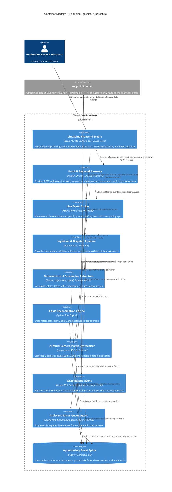
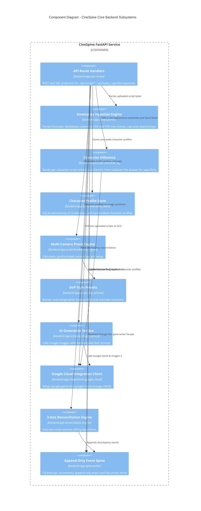
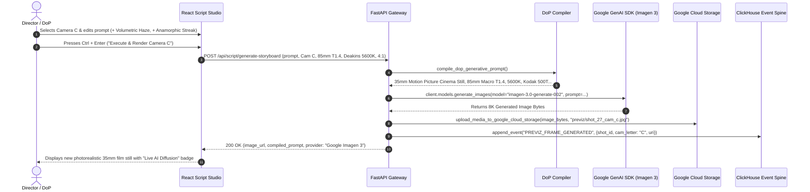
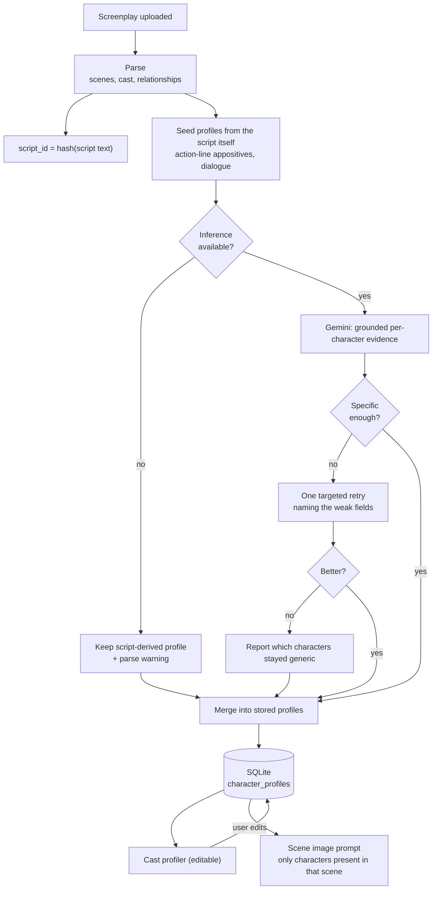
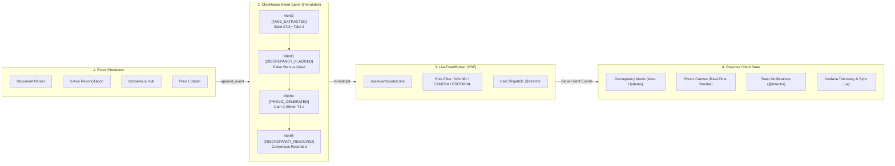

# 🏛️ CineSpine — C4 Architecture Documentation

> Comprehensive structural, container, component, and runtime sequence architecture documentation for **CineSpine** following the **C4 Model**.

**Companion documents:**

- [CLICKHOUSE_MCP.md](CLICKHOUSE_MCP.md) — the contract between the Wrap Rescue
  Agent and the official `mcp-clickhouse` server: tool names, result shapes,
  and why a failed call there can look like a successful one.
- [DEMO_DATA.md](DEMO_DATA.md) — the relationships the demo fixtures in
  `data/examples/` must satisfy for reconciliation and the editorial queue to
  show anything.
- [CLOUD_RUN_DEPLOY.md](CLOUD_RUN_DEPLOY.md) — deploying as a single Cloud Run
  service, and the SQLite constraint that decides its instance count.
- [OBSERVABILITY.md](OBSERVABILITY.md) — what reaches Grafana Cloud, how the
  agents' model calls are traced for Agent Observability, and the CORS failure
  that looks identical from both ends.

---

## 🎬 Animated System Architecture & User Event Flows (SMIL SVG)

### 1. Multi-Persona User Event Flows & Append-Only Event Spine

### 2. End-to-End System Architecture (Production to Cloud)

### 3. Event System & Real-Time SSE Broker

---

## 1. Level 1: System Context Diagram
The System Context diagram illustrates CineSpine within the operational environment of a film & television production unit, showing external practitioners and external cloud ecosystems.

---

## 2. Level 2: Container Diagram
Zooms into the technical boundaries of the CineSpine platform.

> The Wrap Rescue Agent reaches ClickHouse **only** through `mcp-clickhouse`;
> there is no direct driver on that path. That indirection is deliberate — the
> partner component has to be on the runtime path, not beside it — but it means
> a broken tool call is the difference between "the day is clear" and "nothing
> was read". [CLICKHOUSE_MCP.md](CLICKHOUSE_MCP.md) records the contract and the
> guarantees that keep those two apart.

---

## 3. Level 3: Component Diagram (Backend Core)
Details the internal components of the CineSpine Python FastAPI service.

### Note on optical computation

There is deliberately **no backend DoP optics component**. Sensor geometry, angle of view, depth of field
and delivery resolution are computed in the browser (`frontend/src/optics.ts`) because they must respond
to a slider without a round trip. The backend holds *style* (`dop_presets.py`), not *physics*. The two
meet only in the compiled image prompt.

---

## 4. Level 4: Dynamic Runtime Sequence Diagram
Shows the step-by-step lifecycle when a user edits a camera prompt and renders a photorealistic 35mm concept frame.

---

## 5. Character Profile Lifecycle

A character profile is the one artefact in the Script Studio a human authors by hand, and it drives every
generated frame that character appears in. Four properties follow from that, and the design exists to
guarantee them.

**1. Identity is content-derived.** `script_id` is a hash of the normalised screenplay text, so
re-uploading the same script resolves to the same profiles instead of regenerating them.

**2. The merge is asymmetric, on purpose.** Structural fields (dialogue counts, scene presence,
relationships) always come from the fresh parse. Fields a human has edited always win. An edited
character who disappears from a later draft is retained and flagged, not deleted.

**3. Inference can never fail an upload.** Missing key, error, timeout, unparseable output and partial
coverage each leave the script-derived profile in place and add a parse warning. The user is told what
happened rather than shown a silent downgrade.

**4. Specificity is measured, not requested.** A prompt cannot guarantee that "a striking screen presence"
does not come back. Each free-text field is checked for filler words, placeholder phrasing, minimum length
and at least one concrete noun. Only demonstrably better text replaces a weak field.

---

## ⚡ 6. Append-Only Event Spine & Live SSE Fan-Out Architecture

### Animated Event System Diagram (SMIL SVG)

### Event Sourcing & State Projection Model

### Event System Guarantees:
1. **Zero Mutation Invariant:** Events are append-only. Takes and slates are never updated in place; state is computed as a fold over historical events.
2. **Auditability & Traceability:** Every discrepancy resolution, consensus vote, and prompt modification records the originating practitioner handle (`@assistant_editor`, `@director`) and UTC timestamp.
3. **Non-Blocking Real-Time Fan-Out:** The FastAPI `LiveEventBroker` utilizes asynchronous Server-Sent Events (SSE) scoped by `production_id`, `shoot_day`, and user handle to push live updates with sub-millisecond latency and zero browser polling.

### The activity ledger (`user_activity`)

Beside the event spine, which records what a production did, `user_activity`
records what people did to the tool. SQLite is the source of truth and
ClickHouse holds the mirror, like every other store.

Two kinds of row, kept apart in every query and never summed:

- **Views** (`viewed`, `acknowledged`): what a person tells us about their
  attention. Written by the Requirements board through `POST /api/activity`.
- **Mutations** (`created`, `updated`, `resolved`, `reopened`, `deleted`,
  `tagged`, `uploaded`, `linked`, `unlinked`, `ran_agent`): what the API saw
  them change. Written server-side by `_record()` in `backend/app/api/routes.py`
  after every mutation route's write succeeds, so no surface can forget to.
  Never raises: the write it describes has already happened.

Target types: `requirement`, `discrepancy`, `notification`, `shoot_day`,
`scene`, `shot`, `take`, `document`, `production`, `crew`, `script`,
`breakdown`, `tag`, `agent`. The vocabulary is closed; an unknown verb or
target is refused, not stored (`backend/app/spine/activity_store.py`).

Two rules that keep the numbers honest:

- **`actor_source=default`.** A route whose body names nobody (productions,
  crew, script links, breakdowns, bare uploads) records the change under
  `@director` and tags the row's `context_json` with `actor_source: default`.
  Per-person queries exclude those rows; per-department queries keep them.
  The change happened; crediting the director with it would be a fiction.
- **No free text.** `context_json` passes through `analytics.safe_properties`,
  the same blocklist product analytics applies, so a title, note or filename
  cannot reach the ledger by way of a new call site.

What reads it: `GET /api/analytics` carries `actions_by_actor_and_day`,
`actions_by_department_and_hour` and `first_touch_lag`
(`backend/app/spine/analytics.py`), and the production dashboard's Activity
card draws them beside Crew workload. The card says the one thing the
numbers cannot: a count of actions is activity, not effort. Identity is the
self-declared `@handle` from the passwordless login, so per-person figures
are honor-system until there is auth.
