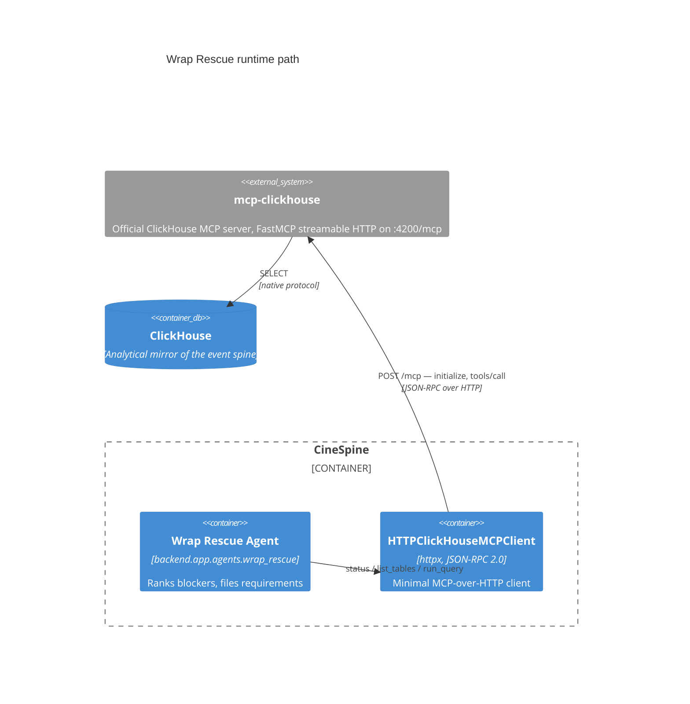

# 🔌 ClickHouse MCP Integration

The Wrap Rescue Agent reaches ClickHouse through the official
[`mcp-clickhouse`](https://github.com/ClickHouse/mcp-clickhouse) server rather
than a direct driver, because the hackathon track requires a visible runtime
path through the partner component. This document records the contract that
path depends on — every clause verified against `mcp-clickhouse` 4.0.0 /
FastMCP 4.0.0 running under `docker compose`.

Each clause below is here because breaking it produced **an empty result that
reported success**. That is the failure mode this integration is prone to, and
the reason the guarantees in §4 exist.

---

## 1. Topology



The server runs as its own compose service built from the same image as the
backend, because `mcp-clickhouse` ships in the project's `hackathon` extra:

```yaml
mcp-clickhouse:
  build: { context: ., dockerfile: backend/Dockerfile }
  environment:
    - CLICKHOUSE_HOST=clickhouse
    - CLICKHOUSE_USER=default          # note: USER here, USERNAME on the backend
    - CLICKHOUSE_MCP_SERVER_TRANSPORT=http
    - CLICKHOUSE_MCP_BIND_HOST=0.0.0.0
    - CLICKHOUSE_MCP_BIND_PORT=4200
    - CLICKHOUSE_MCP_AUTH_DISABLED=true
  command: ["uv", "run", "mcp-clickhouse"]
```

`CLICKHOUSE_MCP_AUTH_DISABLED=true` is honoured — the server logs
`WARNING: MCP SERVER AUTHENTICATION IS DISABLED` at startup and accepts
unauthenticated calls. It is correct for local development only. The backend's
`CLICKHOUSE_MCP_AUTH_TOKEN` is consequently unused; if auth is ever enabled,
the MCP service needs the token too and currently has no `env_file`.

The Dockerfile installs with `uv sync --frozen --all-extras`, which reaches
`hackathon` but also pulls `dev` (pytest, ruff, mypy) into the runtime image.
`--extra hackathon` would be the narrow form.

---

## 2. The tool contract

The server exports exactly three tools. Names matter and are not guessable:

| Tool | Arguments | Returns |
| :--- | :--- | :--- |
| `list_databases` | — | database names |
| `list_tables` | `database`, `page_size`, `include_detailed_columns` | `{"tables": [ {...}, ... ]}` |
| **`run_select_query`** | `query` | `{"columns": [...], "rows": [[...]]}` |

> There is no `run_query`. The client addressed that name for a long time and
> the server answered `Unknown tool: 'run_query'` to every call — see §4.

Confirm the live list rather than trusting this table after a version bump:

```bash
MSYS_NO_PATHCONV=1 docker exec cinespine-backend /app/.venv/bin/python -c "
import asyncio
from backend.app.agents.wrap_rescue import HTTPClickHouseMCPClient
async def main():
    c = HTTPClickHouseMCPClient(); await c._ensure_initialized()
    raw = await c._post_rpc('tools/list', {})
    print([t['name'] for t in raw['tools']])
asyncio.run(main())"
```

The tool name lives in one place, `_RUN_QUERY_TOOL` in `wrap_rescue.py`.

---

## 3. Result shapes

**`run_select_query` answers columnar**, not as a list of objects:

```json
{ "columns": ["n"], "rows": [[139]] }
```

`_coerce_rows` zips the column names onto each row, because everything
downstream — `rank_blockers`, the analytical queries — expects rows keyed by
column name. A reader that looks for dicts inside `rows` finds lists and
returns nothing.

**Transport is streamable HTTP.** The first call must be `initialize`; calls
before it are rejected with `Bad Request: Missing session ID`. The session id
arrives in the `mcp-session-id` response header and must be echoed on every
later request. `_ensure_initialized` handles this. Responses may arrive as
`text/event-stream`, which `_mcp_response_json` unwraps.

---

## 4. Why a failed call can look like a successful one

**This is the central hazard of this integration.** When a tool fails, the
server still answers HTTP 200 with no JSON-RPC `error` key. The reason is
written as *content text* and flagged only by `isError`:

```json
{ "jsonrpc": "2.0", "id": "x",
  "result": { "content": [{ "text": "Unknown tool: 'run_query'", "type": "text" }],
              "isError": true } }
```

Read as data, `"Unknown tool: 'run_query'"` is a string, and a string coerces
to zero rows. So the trace recorded `ok=True, rows=0`. `WrapRescueAgent` checks
`all(call.ok for call in calls)`, found every tool fine, skipped its
`stop_before_mutation` branch, and wrote a producer-facing memo stating the day
had no blockers — having read nothing.

Two rules follow, both now enforced in `_unwrap_mcp_result`:

1. **`isError` is authoritative.** It raises, so `_call_tool` records `ok=False`
   and the agent stops before mutating rather than reporting a clean day.
2. **`ok=True, rows=0` across every call is a symptom, not a result.** A real
   quiet day and a completely broken transport look identical from the outside.

---

## 5. `FINAL` on ReplacingMergeTree

`audit_discrepancies` is a `ReplacingMergeTree` keyed on
`(production_id, shoot_day, discrepancy_type, entity_id)`. Each projection
re-raises the same finding under a **fresh `discrepancy_id`**, so duplicates
are normal and are collapsed by the engine's key — but only once it has merged,
on its own schedule.

A read without `FINAL` therefore sees one problem as two, ranks it twice and
files a duplicate requirement. The demo projects twice on the way in, which is
enough for it to show every time:

```
SELECT count() FROM cinespine.audit_discrepancies WHERE shoot_day='31'        -- 6
SELECT count() FROM cinespine.audit_discrepancies FINAL WHERE shoot_day='31'  -- 3
```

Both queries in `wrap_rescue.py` that read this table use `FINAL`. Any new one
must too. `production_events` and `editorial_tag_events` are plain `MergeTree`
and are unaffected.

---

## 6. Verifying it

The health check is not evidence — it passed throughout the period when no
query returned a row. Assert on rows:

```bash
curl -s http://localhost:8000/api/wrap-rescue/demo | python -m json.tool
```

Against the seeded demo (see [DEMO_DATA.md](DEMO_DATA.md)), a working path
gives **3 blockers and 3 requirement actions** on shoot day 31, with the
discrepancy query reporting `rows=3`.

### Test suite gaps

`test_wrap_rescue_agent.py` injects a fake client that builds its own
`ToolCallTrace(tool="run_query", ...)` labels. It therefore asserts a tool name
the real client never sends, and stayed green for the entire period the real
transport was returning nothing. **The suite does not exercise
`HTTPClickHouseMCPClient` at all.**

Changes to the transport must be verified against the running stack. Pointing
the fake at `_RUN_QUERY_TOOL`, or adding a contract test that asserts the real
client's tool names against a live `tools/list`, would close this.
