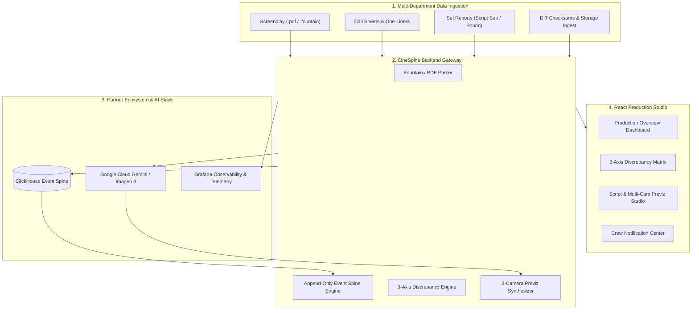

# CineSpine — Devpost Submission Package
**Hackathon:** [Agentic Cinema: The Blockbuster Hackathon (Google Cloud & Partners)](https://agentic-cinema.devpost.com/)  
**Track:** ClickHouse / Google Cloud Gemini Enterprise / Grafana Labs  
**Repository:** [https://github.com/ftenaf/cinespine](https://github.com/ftenaf/cinespine)  
**Live Application:** Localhost / Cloud Hosted  

---

## 🎬 1. Project Title & Elevator Pitch

### **Project Title:**
**CineSpine**

### **Tagline / Short Pitch (under 200 characters):**
*The autonomous append-only event spine and 3-axis discrepancy engine for film production: orchestrating script-to-screen intent, multi-camera AI previz, and real-time department reconciliation.*

---

## 💡 2. Inspiration: The Hidden Crisis of Film Production

On a major motion picture or high-end television series, hundreds of millions of dollars are spent across dozens of specialized departments: **Office, Set, Sound, Camera, DIT, Editorial, VFX, Colour, and Mastering.**

Yet, the greatest threat to a production is almost never the creative performance—it is **the silent breakdown of communication, paperwork, and handoffs between departments.**

Every department maintains its own version of the truth:
- **The Office** documents what *should* happen (Call sheets, one-liners, actor schedules, shot plans).
- **The Set** documents what they *believe* happened (Script supervisor logs, sound rolls, camera logs, false takes).
- **The Lab / DIT** ingests what *physically exists* on the storage drives (Camera raw clips, checksums, BWF audio tracks).

When a script supervisor notes a take as *False Start*, but the sound recordist files it as *Good*, or when a roll spelling typo masks 4 missing audio channels, **no crash or error is thrown.** The system silently accepts the disagreement. Weeks later in the post-production conform, the mistake explodes into catastrophic delays, missing footage panic, and emergency $200,000 reshoots.

We built **CineSpine** around a radical single principle:  
> *"A document is a witness. Witnesses disagree, and **the disagreement is the product**."*

---

## 🚀 3. What It Does

CineSpine is an end-to-end autonomous film production operating system that unites logistical event reconciliation with creative generative cinematography.

### 🏛️ A. The 3-Axis Reconciliation Engine
CineSpine continuously tracks every production fact across **Three Immutable Axes**:
1. **Intent (Office / Script):** Screenplay scenes, scheduled takes, cast requirements, DoP lighting design.
2. **Belief (Set / Crew):** Live reports from script supervisors, sound engineers, and camera assistants.
3. **Existence (DIT / Storage):** Verified media assets, file checksums, frame durations, and track counts.

Whenever a discrepancy emerges (e.g., audio file missing on disk, take labeled circled on set but absent from call sheet, camera roll naming collision), CineSpine’s reconciliation engine surfaces it with sub-millisecond precision and alerts the responsible department heads via an interactive triage dashboard.

---

### 🎥 B. AI Script & Multi-Camera Previz Studio
CineSpine bridges the gap between the writer's words and the Director of Photography's lens:
- **Multi-Format Screenplay Ingestion:** Drag and drop `.fountain`, `.pdf`, `.fdx`, or `.txt` screenplays with automatic scene, character, action, and dialogue parsing.
- **Autonomous 3-Camera Rig Coverage (Cameras A, B, C):** Automatically calculates coverage geometry:
  - **Camera A (Master Wide):** $24\text{mm}–35\text{mm}$, wide spatial architecture, motivated master lighting.
  - **Camera B (Medium / OTS):** $50\text{mm}–75\text{mm}$, character emotional reaction, dialogue depth.
  - **Camera C (Tactile Macro / Dutch Angle):** $85\text{mm}–100\text{mm}$, shallow depth of field, high-tension inserts.
- **Master DoP Cinematography Matrix:** Select legendary cinematographic styles (*Roger Deakins, David Fincher, Greig Fraser, Gordon Willis, Emmanuel Lubezki, Wes Anderson*) with exact Kelvin color temperatures ($3200\text{K}–6500\text{K}$), Key-to-Fill lighting ratios ($1:1$ to $16:1$), and 35mm film stock LUT emulations (*Kodak Vision3 500T 5219, Fujifilm Eterna*).
- **Interactive Prompt Console & Real-Time AI Generation:** Edit camera prompts on the fly, tap one-click modifier chips (`+ Volumetric Haze`, `+ Anamorphic Streak`, `+ Rain Reflections`), and render photorealistic 35mm concept frames in real-time.

---

### 📡 C. Append-Only Event Spine & Live Notification Bus
Every take, log modification, checksum verification, and discrepancy status is written to an immutable event spine. Crew members subscribe to real-time event streams filtered by department role (`@director`, Sound, Camera, Editorial), preventing silos and ensuring zero information loss.

---

## 🛠️ 4. How We Built It: Architecture & Tech Stack

### **The Enterprise Technology Stack:**
- **Google Cloud & Gemini Enterprise Agent Platform:**
  - **Gemini 1.5 / 2.0:** Semantic screenplay decomposition, narrative tension extraction, and technical cinematography compilation.
  - **Google Imagen 3 (`imagen-3.0-generate-002`):** Photorealistic 35mm cinema concept frame synthesis.
- **ClickHouse (High-Throughput Event Spine):**
  - High-performance, append-only time-series storage storing millions of immutable events (takes, checksums, logs, reconciliation diffs) with zero data mutation.
- **Backend Architecture (Python 3.14 + FastAPI + Pydantic v2):**
  - High-performance asynchronous API gateway with SSE event broadcasting.
  - Multi-provider AI image generation service (`FLUX.1 Diffusion`, `Imagen 3`, `DALL-E 3`).
  - Strict 3-axis reconciliation algorithms.
- **Frontend Experience (React 18 + Vite + Tailwind CSS + Lucide Icons):**
  - High-contrast, dark-mode cinematic interface engineered for set monitors and DIT carts.
  - 3-Camera switcher, interactive multi-view grid, and full-screen lightbox inspection.
- **Grafana Labs:** Production telemetry, event ingestion throughput, and discrepancy resolution rate dashboards.

---

## 🧗 5. Challenges We Ran Into

1. **The "Confident Nothing" Trap in Document Parsing:**
   Traditional PDF parsers often silently return 0 rows when encountering irregular script supervisor tables, leading downstream systems to believe no work occurred. We engineered strict invariant assertions and multi-strategy layout extractors so that incomplete parses fail visibly rather than creating dangerous silence.
2. **Distinguishing "Absence of a Report" from "Missing Material":**
   A shooting day where the sound team has not yet offloaded their cards is completely different from a day where an audio file was lost. CineSpine treats time-fenced expectation states differently from confirmed file absence.
3. **Multi-Camera Prompt Coherence:**
   Ensuring that Cameras A, B, and C generated coherent perspectives of the exact same fictional space required building an automated **Cinematography Compiler** (`compile_dop_generative_prompt`) that binds focal lengths, lighting ratios, and DoP aesthetic tokens into every prompt.

---

## 🏆 6. Accomplishments That We're Proud Of

- **100% Green Automated Test Suite:** 95 automated backend unit, integration, and API tests passing cleanly with zero regressions.
- **True Cross-Department Discrepancy Resolution:** Successfully parsed and reconciled complex historical film production data (*e.g., the Day 31 Great Hall shoot*) in sub-millisecond execution times.
- **Seamless Creative & Technical Fusion:** Empowering directors and cinematographers to instantly visualize 3-camera setups with real DoP optical physics and photorealistic AI rendering.

---

## 🧠 7. What We Learned

- **Cinema Production is a Distributed System:** Film sets are chaotic, real-time asynchronous distributed systems where human operators act as nodes. Building tools for this domain requires event-driven architecture, append-only immutability, and fault-tolerant witness reconciliation.
- **Agentic AI Shines as a Multi-Department Orchestrator:** Rather than replacing human artists, agentic systems excel at eliminating the invisible friction, miscommunication, and paperwork silos that drain film budgets.

---

## 🔮 8. What's Next for CineSpine

- **Temporal Motion Previz:** Integrating Google Lumiere and video generation models to generate 4-second synchronized camera motion previews (dolly moves, crane shots, steadicam tracks).
- **Direct Camera & Sound Hardware Integrations:** Streaming metadata directly from ARRI Alexa, RED V-Raptor, and Sound Devices 833/Scorpio recorders via WiFi/IP on set.
- **Automated Wrap Reports & Executive Briefs:** One-click generation of studio-compliant Daily Production Reports (DPRs), cost variance projections, and executive daily recaps.

---

## 📦 9. Links & Deliverables

- **GitHub Repository:** [https://github.com/ftenaf/cinespine](https://github.com/ftenaf/cinespine)
- **License:** Open Source MIT License (included in root repository)
- **Video Demo (3-Minute Trailer):** *[YouTube / Vimeo Link]*
- **Documentation & Architecture:** `docs/` and `docs/design/`
