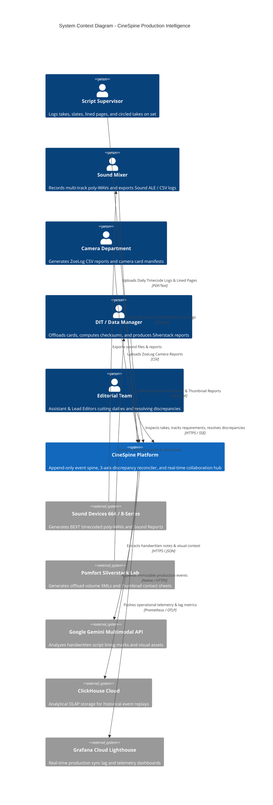
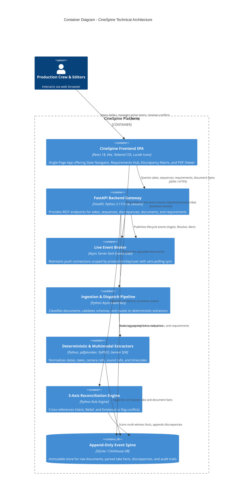
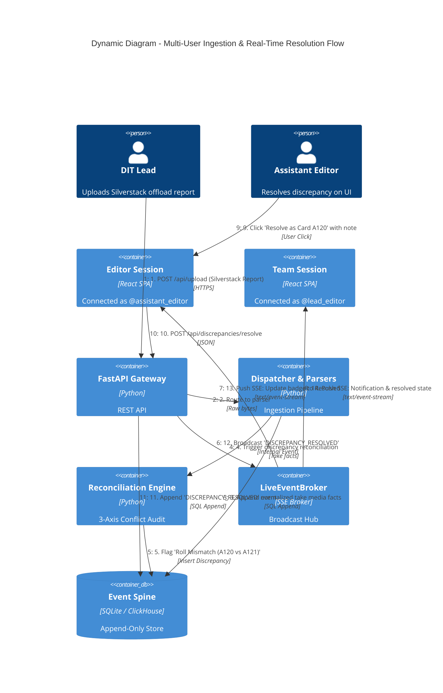

# CineSpine - C4 Architecture Documentation

> Comprehensive C4 Model Diagrams (System Context, Containers, Components, and Dynamic Workflows) for the CineSpine Event-Sourced Film & TV Production Reconciliation Platform.

---

## 1. Level 1: System Context Diagram

The System Context diagram illustrates CineSpine within the film and television production environment, showing external stakeholders, departmental hardware, and external cloud services.

---

## 2. Level 2: Container Diagram

The Container diagram zooms into CineSpine to show the high-level technical building blocks: the frontend single-page application, FastAPI application, real-time SSE broker, ingestion pipeline, and data storage.

---

## 3. Level 3: Component Diagram (FastAPI Backend)

The Component diagram shows the modular structure of the backend application in `backend/app/`.

```mermaid
C4Component
  title Component Diagram - CineSpine Backend Architecture

  Container(spa, "React SPA", "TypeScript", "Frontend Client")

  Container_Boundary(backend, "FastAPI Application") {
    Component(routes, "API Routes & Endpoints", "backend.app.api.routes", "REST endpoints for /api/takes, /api/sequences, /api/requirements, /api/seed")
    Component(live_broker, "LiveEventBroker", "backend.app.streaming.broker", "Manages active SSE subscriber queues and synchronous event broadcast")
    Component(dispatcher, "IngestionDispatcher", "backend.app.streaming.dispatcher", "Routes files to departmental parsers and publishes raw events")
    Component(event_bus, "SpineEventBus", "backend.app.streaming.bus", "Pub/sub event bus segregating topics (production.raw.*)")
    Component(classifier, "DocumentClassifier", "backend.app.classifier.classifier", "Detects document type and department via header signatures")
    Component(camera_parser, "CameraParser", "backend.app.parsers.camera_csv", "Parses ZoeLog CSV reports with roll & clip extraction")
    Component(sound_parser, "SoundParser", "backend.app.parsers.sound_ale", "Parses Sound ALE/CSV reports with BEXT timecodes")
    Component(script_parser, "ScriptParser", "backend.app.parsers.pdf_parsers", "Parses daily TCLogs and detailed editor logs")
    Component(silverstack_parser, "SilverstackParser", "backend.app.parsers.parsers", "Parses Silverstack volume XMLs and thumbnail sheets")
    Component(normalizers, "Normalizers", "backend.app.normalizers", "Folds slates (27/7), takes (3*), and camera rolls (A120)")
    Component(recon, "ReconciliationEngine", "backend.app.reconciliation.engine", "Evaluates circle take conflicts, TC drift, and missing media")
    Component(spine_writer, "SpineStore & Writer", "backend.app.api.routes", "Stores raw documents, events, discrepancies, and requirements in SQLite/ClickHouse")
    Component(agents, "Discrepancy Agent", "backend.app.agents.discrepancy_agent", "Generates natural language conflict explanations")
  }

  Rel(spa, routes, "HTTP REST Queries & Mutations")
  Rel(spa, live_broker, "SSE Stream Subscription (/api/events/subscribe)")

  Rel(routes, spine_writer, "Queries & Mutates State")
  Rel(routes, live_broker, "Pushes Live Events")
  Rel(routes, dispatcher, "Submits Ingestion Payloads")

  Rel(dispatcher, classifier, "Classifies Document")
  Rel(dispatcher, event_bus, "Publishes Raw Upload Events")
  Rel(dispatcher, camera_parser, "Delegates Camera Reports")
  Rel(dispatcher, sound_parser, "Delegates Sound Reports")
  Rel(dispatcher, script_parser, "Delegates Script Logs")
  Rel(dispatcher, silverstack_parser, "Delegates Offload Manifests")

  Rel(camera_parser, normalizers, "Normalizes Roll & Slate")
  Rel(sound_parser, normalizers, "Normalizes Take & Timecode")
  Rel(script_parser, normalizers, "Normalizes Action Notes")

  Rel(dispatcher, recon, "Triggers 3-Axis Audit")
  Rel(recon, spine_writer, "Persists Discrepancies")
  Rel(recon, agents, "Explains Conflicts")
```

---

## 4. Level 4: Dynamic Diagram (Collaborative Ingestion & Resolution Flow)

This Dynamic diagram tracks the end-to-end event sequence when a new document is dropped, a discrepancy is flagged, and an editor resolves it.

